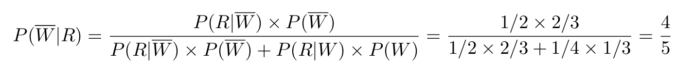

# Bayes’ Rule

Created: 2024年11月28日 14:48
Class: COMS10014

# Bayes’ Rule

## 定义

For events $A,B$on a probability space $\Omega$$A,B$

$$
⁍
$$

Combine with the total probability rule,

$$
P(A|B) = \frac{P(B|A)\times P(A)}{P(B|A)\times P(A)+P(B|\overline A)\times P(\overline A)}
$$

The random variable version is

$$
p_{A|B}(a,b)=\frac {p_{B|A}(b,a)\times P(A)}{p_B(b)}
$$

or with the total probability rule

$$
p_{A|B}(a,b)=p_{B|A}(b,a)\times P_A (a) \div (\sum_{a'\in \mathcal A }p_{B|A}(b,a')\times p_A(a'))
$$

# 示例

## 示例 1

天气与降雨的概率

假设：

- 2/3的天是寒冷的，1/3的天是温暖的。
- 在寒冷的日子里，1/2的时间会下雨；在温暖的日子里，1/4的时间会下雨。

如果今天在下雨，那么今天是寒冷天气的概率是多少？

**解释**：这是一个应用贝叶斯定理的经典例子。我们已知天气类型和下雨的条件概率，现在我们想根据观察到的“下雨”这一信息来推算今天是寒冷天气的概率。根据贝叶斯定理，我们需要计算的是：

$$
P(寒冷 |下雨) = \frac{P(下雨|寒冷)\times P(寒冷)}{P(下雨)}
$$

其中：

- $P(寒冷)=2/3$，即寒冷天气的先验概率。
- $P(下雨|寒冷)=1/2$，即在寒冷天气下下雨的条件概率。
- $P(下雨)$是下雨的总概率，应该通过全概率公式计算：
    
    $P(下雨)=P(下雨|寒冷)⋅P(寒冷)+P(下雨|温暖)⋅P(温暖)$
    
    $P(下雨)=(1/2)⋅(2/3)+(1/4)⋅(1/3)=5/12$
    
    
    
    $$
    P(寒冷|下雨)=\frac{\frac12 \times \frac 23}{\frac {5}{12}}=\frac45
    $$
    

所以，在知道今天下雨的情况下，今天是寒冷天气的概率为 **4/5**

## 示例 2

# Base rates

## 示例 1

假设：

- 5%的人口患有某种遗传病。
- 一家公司开发了一种90%准确的测试：如果你有病，测试有90%的概率显示阳性；如果你没有病，测试有90%的概率显示阴性

using D for the event that you have the disease and T for the event that the 
test comes back positive

用D表示有疾病 用T表示阳性

你接受了测试，结果显示阳性。那么，你患病的概率是多少？

# Testing, Experiments and Classifiers

$$
P(有病|阳性)=\frac {P(阳性|有病)\cdot P(有病)}{P(阳性)}
$$

我们使用不同的测试工具来判断这个真实状态。测试结果有四种可能

- **真阳性（True Positive, TP）**：真实状态为阳性，测试结果也为阳性。
- **假阳性（False Positive, FP）**：真实状态为阴性，测试结果错误地显示为阳性。
- **假阴性（False Negative, FN）**：真实状态为阳性，测试结果错误地显示为阴性。
- **真阴性（True Negative, TN）**：真实状态为阴性，测试结果也为阴性。

## 定义

- **敏感性（Recall）**：测试在所有真实阳性样本中正确识别阳性样本的能力，计算公式为：$\text{敏感性} = P(E|\text{T}) = \frac{TP}{TP + FN}$
    - **解释**：敏感性反映了测试能找到真实阳性样本的比例，计算的是所有患病（或真实阳性）的人中，测试结果正确为阳性的比例。敏感性高的测试在“找出病人”上表现更好。
- **特异性（Specificity）**：测试在所有真实阴性样本中正确识别阴性样本的能力，计算公式为：$\text{特异性} = P(E|\neg \text{T}) = \frac{TN}{TN + FP}$
    - **解释**：特异性反映了测试能够识别不患病（或真实阴性）样本的能力。特异性高的测试在“避免误诊”上表现更好。
- **精确度（Precision）**：测试在所有预测为阳性的样本中，实际阳性样本的比例，计算公式为：$\text{精确度} = P(\text{T}|E) = \frac{TP}{TP + FP}$
    - **解释**：精确度衡量的是测试结果为阳性时，实际阳性样本的比例。精确度高说明阳性预测错误的几率较小。
- **准确度（Accuracy）**：测试正确预测的比例，计算公式为：$\text{准确度} = \frac{TP + TN}{TP + TN + FP + FN}$
    - **解释**：准确度反映了测试在所有测试样本中正确预测的比例。准确度高的测试能够在整体上正确分类更多的样本。
- **F1分数（F1 Score）**：在机器学习中，常用的一个指标，它综合考虑了精确度和敏感性，计算公式为：${F1分数} = \frac{2TP}{2TP + FP + FN}$
    - **解释**：F1分数是精确度和召回率（敏感性）的调和平均数。在数据不平衡的情况下，F1分数比准确度更能反映测试的表现。

# Simpson’s Paradox

## 示例 1

### 背景设定：

- 有一个研究比较了两种治疗方法（**A** 和 **B**）对肾结石的疗效。
- 肾结石可以分为两种类型：大肾结石（L）和小肾结石（S）。
- 研究结果显示：
    - 对于 **大肾结石**，治疗 **B** 更有效（73%改善率 vs 69%改善率）。
    - 对于 **小肾结石**，治疗 **B** 也是更有效（93%改善率 vs 87%改善率）。

### 数据表示：

|  | **治疗A** | **治疗B** |
| --- | --- | --- |
| **大结石（L）** | 55/80 = 69% | 192/263 = 73% |
| **小结石（S）** | 234/270 = 87% | 81/87 = 93% |

然而，当将数据合并（也就是看所有病人的整体数据时），结果却显示 **治疗A的改善率（83%）比治疗B（78%）更好**。

**整体数据**：

- 治疗A的改善率：$\frac{55+234}{80+270} = 83\%$
- 治疗B的改善率：$\frac{192+81}{263+87} = 78\%$

在整体数据中，治疗A的改善率高于治疗B，但在每个子组（大结石和小结石）中，治疗B的效果都更好。这看起来很反常，因为按理说，如果治疗B对每种类型的结石都更有效，那么在整体上治疗B应该会更好才对.由于大结石患者较多，而且治疗B的效果相对较差，因此在整体数据中，治疗A的效果看起来更好。虽然每个子组中治疗B更有效，但因为大结石患者的数量更大，导致整体数据得出了治疗A更好的结论

# Conditional Probability with 3 Variables

## 示例

我们假设以下三个变量：

- **A**：患者是否接受治疗A（治疗A为1，治疗B为0）
- **I**：患者是否改善（改善为1，未改善为0）
- **L**：患者是否患有大结石（大结石为1，小结石为0）

假设我们得到如下联合概率数据：

| **治疗方法（A）** | **结石类型（L）** | **改善（I）** | 联合概率 P(A,L,I) |
| --- | --- | --- | --- |
| 1 (治疗A) | 1 (大结石) | 1 (改善) | 55/700 |
| 1 (治疗A) | 1 (大结石) | 0 (未改善) | 25/700 |
| 1 (治疗A) | 0 (小结石) | 1 (改善) | 192/700 |
| 1 (治疗A) | 0 (小结石) | 0 (未改善) | 71/700 |
| 0 (治疗B) | 1 (大结石) | 1 (改善) | 234/700 |
| 0 (治疗B) | 1 (大结石) | 0 (未改善) | 36/700 |
| 0 (治疗B) | 0 (小结石) | 1 (改善) | 81/700 |
| 0 (治疗B) | 0 (小结石) | 0 (未改善) | 6/700 |

从表格中，我们可以看到每个组合的联合概率。比如，治疗A且患有大结石且改善的概率是 $\frac{55}{700}$，治疗B且患有小结石且改善的概率是 $\frac{81}{700}$，等等。

$P(I=1|A=1)=\frac{P(A=1,I=1)}{P(A=1)}=\frac{P(A=1,L=1,I=1)+P(A=1,L=0,I=1)}{P(A=1)}$

其中$P(A=1,L=1,I=1)=\frac{55}{700}$

$P(A=1,L=0,I=1)=\frac{192}{700}$

$P(A=1)=\frac{80+270}{700}$

所以

$P(I=1|A=1)=\frac{55+192}{350}=\frac{247}{350}≈0.7057$
