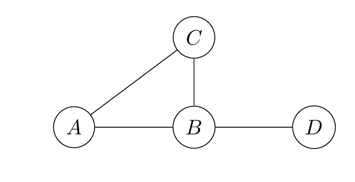

# Combinatorics

Created: 2024年11月24日 16:47
Class: COMS10014

# Combinatorics

想象一下，你有一个有m 个格子的表格，每个格子必须放入一个来自n 个符号列表中的符号，每个格子的选择彼此独立——例如，你可以多次使用同一个符号。那么有多少种方法可以完成这件事？

对于第一个格子，有n 种可能性。对于第二个格子，又有n 种可能性。总的来说，这会给出$n^m$种不同的可能性

如果每个格子中不能重复使用同一个元素怎么办？显然，这只有在$n \geq m$的情况下才可行

第一个格子n 种选择，第二个格子有n−1 种选择，以此类推，所以所有可能的排列数是

$1 \times 2 \times \ldots \times n$

这种计算方式出现得非常频繁，以至于我们用$n!$ 表示，读作“n 的阶乘”

<aside>
💡

$$
0！=1
$$

</aside>

如果需要用一个大小为n 的集合中的不同元素填充m 个格子，那么公式变为

$$
⁍或者⁍
$$

# Choices

## 定义

从 $n$ 个元素的集合中选择 $k$ 个元素的子集

## Basic combinatorics

对于$n, k \in \mathbb{N}$ 其中$n \geq k$

### n choose k (C组合)

$$
\binom{n}{k} = \frac{n!}{k! \times (n - k)!}
$$

# Double-counting

是数学中一个重要且实用的证明方法。它的核心思想是：如果通过两种不同的方法对同一个量进行计数，那么得到的结果必然相等。尽管这个原则看起来显而易见，但它在解决许多数学问题时非常有效。

数学上，一个无向图由顶点集 $V$ 和边集 $E$ 构成。这里$V = \{A, B, C, D\}$，而边集 $E$ 是由形如$\{v, w\}$的集合组成，其中$w \in V$，且$v \neq w$

顶点v 的度数$\text{deg}(v)$是连接到它的边的数量，因此如果你统计所有顶点的度数，总和为$\sum_{v \in V} \deg(v)$

$顶点 A 有两条边连接到它(\{A, B\} 和 \{A, C\}），因此 \deg(A) = 2$

但这与统计所有边的次数（每条边被两端的顶点各统计一次）是一样的，因此根据双重计数原理，有

$\sum_{v \in V} \deg(v) = 2|E|$

$\sum_{v \in V} \deg(v) = 2 \times |E| = 8$

- 这意味着所有顶点度数的总和必须是偶数
- 度数为奇数的顶点数量也必须是偶数（否则总和就无法为偶数）。这一结论被称为 **握手定理🤝**（Handshaking Lemma）
- 举个例子🌰（怎么这么抽象😶）
    
    ### **双计数推导：**
    
    1. 按 **胜场** 计数：
        - 将所有比赛按照胜者排序，记录每支队伍的胜场数。
        - 胜场数的总和为：$W1​+W2​+⋯+Wn$
    2. 按**败场**计数：
        - 将所有比赛按照败者排序，记录每支队伍的败场数。
        - 败场数的总和为：$L1​+L2​+⋯+Ln​$
    3. 根据双计数原则：
        - 每场比赛产生一次胜利和一次失败，总计为所有比赛场次的两种计数方式：   $W1​+W2​+⋯+Wn​=L1​+L2​+⋯+Ln​$
    - 总胜场数等于总败场数

# Double-counting choices

## Choice formulas

For natural numbers $n,k$ with $n ≥ k$ we have

$$
\sum_{i=0}^{n} \binom{n}{i} = 2^n \quad \text{and} \quad \binom{n}{k} = \binom{n}{n-k}
$$

# Multinomials

$$
\binom{n}{k_1, \ldots, k_m} = \frac{n!}{k_1! \times \ldots \times k_m!}
$$

## 示例

假设有

**6个人** A,B,C,D,E,F，需要分成 **3组**

第一组 G1 : 2人
第二组 G2 : 3人
第三组 G3 : 1人

这里总人数 $n$ 为 6 各组大小为$k_1=2, k_2=3,k_3=1$

$$
\binom{6}{2, 3, 1} = \frac{n!}{k_1! \times k_2! \times k_3!} = \frac{720}{12} = 60
$$

# The inclusion-exclusion principle

为了统计$A \cup B$ 中的元素数量，你可以将其划分为仅在$A$ 中的元素、仅在$B$ 中的元素以及同时在$A$ 和$B$ 中的元素

$$
|A \cup B| = |A \setminus B| + |B \setminus A| + |A \cap B|
$$

如果直接计算 $A$ 和 $B$ 的大小，会导致交集部分的元素被重复计数

因此，我们可以从没有遗漏任何元素开始，但交集中的元素被重复计数了两次 所以

$$
|A \cup B| = |A| + |B| - |A \cap B|
$$

同样的思想适用于三个集合

$$
|A \cup B \cup C| = |A| + |B| + |C| - |A \cap B| - |A \cap C| - |B \cap C| + |A \cap B \cap C|
$$

三个集合的容斥公式

- **加上单个集合的大小**：$∣A∣+∣B∣+∣C∣$。
- **减去两两交集的大小**：因为每两个集合的交集在第一步被多次计数，所以减去
    
     $|A \cap B|, |A \cap C|, |B \cap C|$
    
- **加回三集合交集的大小**：三集合交集在前两步中被多次减去，因此需要加回一次。

n 个集合的容斥公式

对于$n$个集合的$A_1,A_2,...,A_n,$容斥公式为

$$
\left| \bigcup_{i=1}^n A_i \right| = \sum_{k=1}^n (-1)^{k+1} \sum_{1 \leq i_1 < i_2 < \cdots < i_k \leq n} \left| A_{i_1} \cap A_{i_2} \cap \cdots \cap A_{i_k} \right|
$$

# Independence means multiplication

如果你正在计算的事物的两个属性是“独立的”，那么通常可以将它们的数量相乘

- **独立性**：两个属性或事件的独立性意味着一个属性的发生或选择不会影响另一个属性的发生或选择。
- **乘法原则**：当两个属性独立时，总的可能性等于每个属性的可能性相乘。

## 示例

一副扑克牌中选一张卡牌，独立考虑“花色”和“点数”，总的卡牌数量是$4×13=52$
