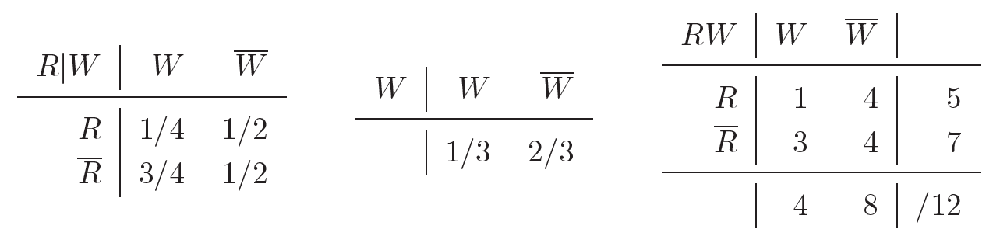

# Conditional Probability

Created: 2024年11月25日 13:27
Class: COMS10014

# Conditional Probability

## 定义

条件概率是指在已知某个事件$B$发生的前提下，事件$A$发生的概率。用数学语言表示就是$P(A|B)$。

$$
P(A|B)=\frac{P(A\cap B)}{P(B)}
$$

这里 $P(A \cap B)$ 是$A$和$B$同时发生的概率，而$P(B)$ 是事件$B$发生的概率。如果$P(B)=0$，即事件$B$不可能发生，则条件概率$P(A∣B)$ 没有定义。

<aside>
💡

$P(A|B)$  Pronounced ‘Probability of  A given B’

</aside>

## 示例

假设你掷一个六面骰子，想知道掷出偶数的概率，且已知骰子的结果大于3。在这种条件下，可能的结果只有$4, 5, 6$，其中偶数是$4$和$6$。所以，条件概率

$$
⁍ = ⁍= ⁍=⁍
$$

# Conditional distributions

## 定义

条件分布是指给定某个随机变量的取值之后，另一个随机变量的分布情况。假设有两个随机变$A$ 和$B$，它们的联合分布是$p_{A,B}(a,b)$，那么条件分布可以表示为

$$
⁍

$$

- $p_{A,B}(a,b)$ 是随机变量$A$和$B$同时发生的概率。
- $p_B(b)$ 是$B$取值为$b$时的概率。

## 示例

假设你掷一个骰子，遮住了骰子的结果，但别人告诉你结果至少是4。你想知道在这种条件下，掷出偶数的概率是多少。此时，已知掷出的点数大于或等于4，可能的结果只有4、5、6，偶数的结果只有4和6，所以条件概率就是$P(\text{偶数} | \text{大于3}) = \frac{2}{3}$，这与之前的例子是类似的。

# The conditional sum rule

## 定义

$$
P(A|B) + P(\overline A|B) = 1
$$

<aside>
💡

**条件概率的所有可能结果的概率总和等于1**

</aside>

对于随机变量 $A:\Omega\rightarrow\mathcal A$  and $B:\Omega \rightarrow\mathcal B$ 我们有

$$
\forall b \in \mathcal{B}, \quad \sum_{a \in \mathcal{A}} P_{A|B}(a, b) = 1
$$

# Joint and marginal tables

## 定义

**联合概率**

描述的是两个随机变量同时发生的概率。假设我们有两个离散随机变量$A$ 和 $B$，它们的联合分布可以用一个**联合概率表**（joint probability table）来表示。

|  | $A$ | $\overline A$ | 总计 |
| --- | --- | --- | --- |
| $B$ | 24/64 | 12/64 | 36/64 |
| $\overline B$ | 24/64 | 4/64 | 28/64 |
| 总计 | 48/64 | 16/64 | 64/64 |

这样可以直观的看出概率

# The total probability rule

## 定义

For events A,B in a sample space Ω

$$
\ P(A) = P(A \cap B) + P(A \cap \overline{B})
$$

$$
\ P(A) = P(A \mid B) P(B) + P(A \mid \overline{B}) P(\overline{B})
$$

For random variables $A, B$ with ranges $\mathcal{A}, \mathcal{B}$, the same rules:

$$
\forall a \in \mathcal{A}, \ p_A(a) = \sum_{b \in \mathcal{B}} p_{AB}(a, b)
$$

$$
\forall a \in \mathcal{A}, \ p_A(a) = \sum_{b \in \mathcal{B}} p_{A \mid B}(a, b) \cdot p_B(b)
$$

# Examples

### 例子 1：天气预报问题

### 问题描述：

假设大多数日子是寒冷的，2/3的日子是冷的，1/3的日子是暖的。冷天中，下雨的概率是1/2；而暖天中，下雨的概率是1/4。我们现在要计算两个问题：

1. 总体下雨的概率是多少？
2. 如果今天下雨，今天是冷天的概率是多少？

### 解决过程：

**步骤 1：计算总体下雨的概率**

根据**全概率法则**，我们可以通过不同天气情况下下雨的概率加权得到总体下雨的概率。

- $P(\text{冷天}) = \frac{2}{3}$
- $P(\text{暖天}) = \frac{1}{3}$
- $P(\text{下雨} | \text{冷天}) = \frac{1}{2}$
- $P(\text{下雨} | \text{暖天}) = \frac{1}{4}$

根据全概率法则：

$$
⁍
$$

代入给定的值：

$$
P(\text{下雨}) = \left( \frac{1}{2} \times \frac{2}{3} \right) + \left( \frac{1}{4} \times \frac{1}{3} \right) = \frac{1}{3} + \frac{1}{12} = \frac{5}{12}
$$

所以，总体下雨的概率是 $\frac{5}{12}$。

**步骤 2：计算今天下雨时是冷天的条件概率**

接下来，我们使用**贝叶斯定理**来计算在已知今天下雨的条件下，今天是冷天的概率。根据贝叶斯定理：

$$
P(\text{冷天} | \text{下雨}) = \frac{P(\text{下雨} | \text{冷天}) P(\text{冷天})}{P(\text{下雨})}
$$

代入已知的值：

$$
P(\text{冷天} | \text{下雨}) = \frac{\left( \frac{1}{2} \times \frac{2}{3} \right)}{\frac{5}{12}} = \frac{\frac{1}{3}}{\frac{5}{12}} = \frac{4}{5}
$$

所以，如果今天下雨，那么今天是冷天的概率是 $\frac{4}{5}$。

Joint 表格如下

