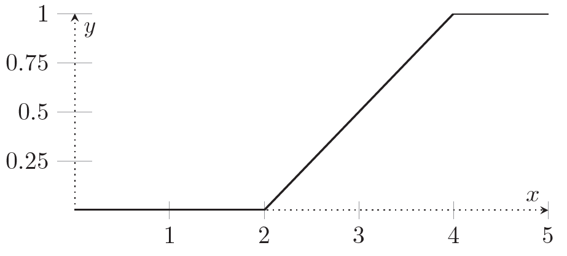
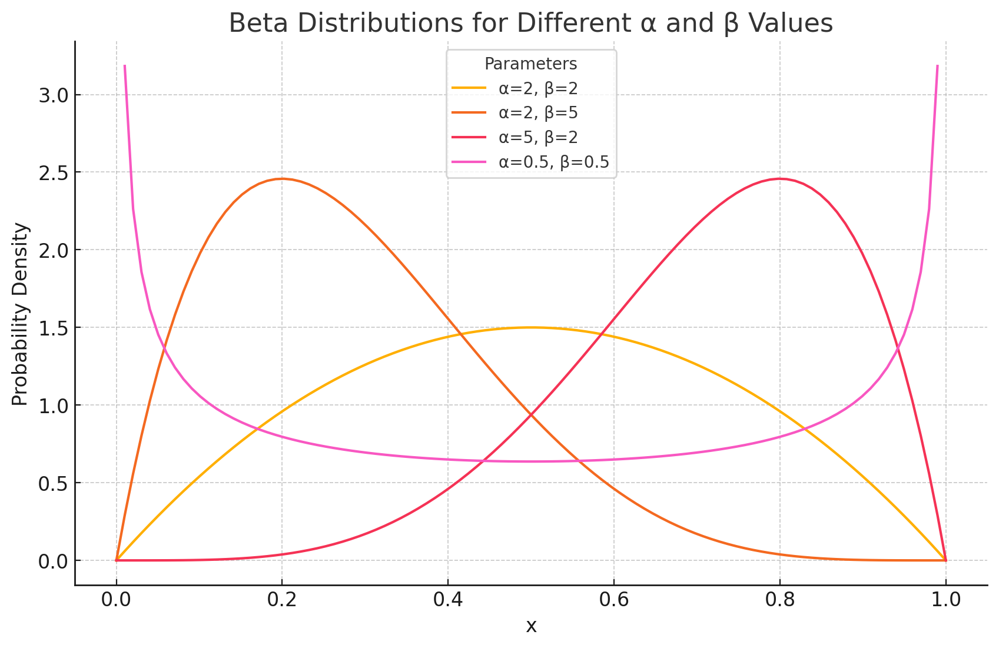

# Continuous Probability

Created: 2024年12月8日 17:34
Class: COMS10014

# To Infinity and Beyond

- **连续概率**：在连续概率空间中，我们不能简单地为每个单独的元素 $ω$ 指定一个概率值。
- **均匀分布**：对于有限集合的均匀分布，每个元素的概率是相同的；但对于自然数等可数无限集合，均匀分布是不可定义的。在实数区间上，我们可以定义均匀分布。

# Continuous Probability

## 定义

一个**连续概率空间**是一个三元组，表示为 ($\Omega, \Sigma, P)$，其中：

- $\Omega$ 是**样本空间**（sample space），即所有可能的实验结果的集合。
- $\Sigma$ 是一个**$σ-$代数**（sigma-algebra），即我们可以在其上定义概率的事件的集合。
- $P$ 是一个**概率测度**（probability measure），即定义在 $Σ$ 上的一个函数，表示每个事件发生的概率。
- $P(Ω)=1$ —— 样本空间的总概率是 1。
- $P(\emptyset) = 0$ —— 空集的概率是 0。
- 对于任何不相交事件$Ei$的至多可数无限的集合 that is $∀i.Ei ∈ Σ \;and\; ∀i, j. (i \neq j → Ei ∩ Ej = ∅)$, we have

$$

⁍
$$

# Cumulative Distributions

在离散概率中，我们定义了一个概率分布 $p(\omega)$，并且可以通过累计每个小于等于 $\omega$ 的值的概率来得到**累积分布函数**（CDF）。例如，如果$\Omega = \mathbb{N}$，那么 $c(3)$ 就是 $p(0)+p(1)+p(2)+p(3)$。

在**连续概率空间**中，我们通常没有像离散情况那样的概率分布（即单个点的概率为零），但我们始终可以定义累积分布函数 $c(\omega)$，它表示随机变量小于或等于某个值的概率。

### **连续累积分布函数 :**

对于均匀分布在区间 $[a,b]$ 上，累积分布函数为：

$$
c(x)=\frac{x-a}{b-a},当a\leq x\leq b
$$

      在 $x$ 小于 $a$ 时，$c(x)=0$，

在 $x$ 大于 $b$ 时，$c(x)=1$。

## 性质

- **非递减性（Non-decreasing）**：对于任意的实数 $x$ 和 $y$，如果 $x \leq y$，那么 $c(x) \leq c(y)$。这意味着随着 $x$ 的增大，累计的概率不会减少。
- **极限性质**：
    - 当 $x→−∞$ 时，$c(x)→0$。也就是说，如果 $Ω$ 是一个包含无限小值的区间，那么随机变量小于任何有限数值的概率趋近于 $0$。
    - 当 $x→∞$ 时，$c(x)→1$。即随着 $x$ 无限增大，随机变量小于或等于 $x$ 的概率趋近于 1。
    - 如果样本空间 $Ω$ 有一个最大元素 $z$，那么  $c(z)=1$。
- **满足概率空间的基本条件**：
    - $c(x)$ 代表的是一个概率，值域在 $[0,1]$ 之间。
    - $c(x)$ 必须是连续的或在大多数情况下具有右连续性，尽管不必在每个点都有导数。

# The Continuous Uniform Distribution

连续均匀分布是最简单的连续分布之一。它的特点是，在给定的区间内，所有的结果都有相同的概率，即每个数值在区间内出现的概率是均等的

在区间 $[a,b]$ 上的**连续均匀分布**是这样的一个概率分布，样本空间 $\Omega = [a, b]$，其中的每个子区间都具有相同的概率。

- **概率密度函数 (PDF)**：对于区间 $[a,b]$ 上的连续均匀分布，其概率密度函数为：
    
    $$
    p(x)=\frac {1}{b−a}, 对于a≤x≤b
    $$
    
    其中 $a$ 和 $b$ 是区间的下界和上界，且 $a < b$。
    
- **概率密度函数的性质**：由于这个分布在整个区间内是均匀的，概率密度函数是常数 $\frac{1}{b - a}$。换句话说，样本空间 $[a, b]$内的每个点 $x$ 出现的概率密度都相同。对于一个区间内的任何子区间，其概率仅与该子区间的长度成正比。
- **单点概率为零**：对于一个连续分布，任何单一的点 x 的概率都是 0，即 $P(\{x\}) = 0$。这与离散分布的情况不同，离散分布的点有非零概率。
- **累积分布函数 (CDF)**c(x) 描述的是随机变量X 小于或等于某个值x 的概率。对于均匀分布，CDFc(x) 是线性函数，可以通过概率密度函数积分得到
    
    $$
    c(x)=\frac{x-a}{b-a},对于a\leq x \leq b
    $$
    

均匀分布的期望是区间的中点$\frac{a + b}{2}$

方差是$\frac{(b - a)^2}{12}$

- 示例 1
    
    ### 示例：均匀分布的累积分布函数
    
    **问题：**
    
    假设一个随机变量 $X$ 在区间 $[2,4]$ 上均匀分布，计算在区间 $[2,3]$ 内的概率。
    
    ### 解析：
    
    1. **概率密度函数**（PDF）：
        
        对于 $X \sim \text{Uniform}(2, 4)$，我们知道概率密度函数是：
        
        $$
        ⁍
        $$
        
        这意味着在区间 $[2,4]$ 内，每个值的概率密度都是 $\frac{1}{2}$，即均匀分布。
        
    2. **累积分布函数**（CDF）：
        
        对于均匀分布，累积分布函数是线性的，表示随机变量 $X$ 小于等于某个值的概率。在区间 $[2,4]$ 上，累积分布函数 $c(x)$ 为：
        
        $$
        c(x) = \frac{x - 2}{4 - 2} = \frac{x - 2}{2}, \quad 2 \leq x \leq 4
        $$
        
        这意味着：
        
        - 当 $x=2$ 时，$c(2)=0$，即随机变量 X 小于或等于 2 的概率是 0；
        - 当 $x=4$ 时，$c(4)=1$，即随机变量 X 小于或等于 4 的概率是 1；
        - 在区间 $[2,4]$ 内，$c(x)$ 线性递增。
    3. **计算概率**：
        
        要计算 $X$ 落在区间 $[2,3]$ 的概率，我们使用累积分布函数：
        
        $$
        P(2 \leq X \leq 3) = c(3) - c(2)
        $$
        
        代入 $c(x) = \frac{x - 2}{2}$：
        
        $$
        c(3) = \frac{3 - 2}{2} = \frac{1}{2}, \quad c(2) = \frac{2 - 2}{2} = 0
        $$
        
        所以：
        
        $$
        ⁍
        $$
        
        也就是说，随机变量 $X$ 落在 $[2,3]$ 的概率是 50%。
        
        下图为[2,4]均匀分布的累积分布图
        
        
        

# Probability Density Functions (PDF)

## 定义

对于任何区间 $[a,b]$，该区间内的概率可以通过对 PDF 在该区间上的积分来计算

$$
P(a \leq X \leq b) = \int_{a}^{b} p(x) \, dx
$$

## 性质

- **概率密度函数的性质**：
    - PDF $p(x)$ 需要满足非负性：$p(x)≥0$ 对于所有的 $x∈\R$。
    - 在整个实数范围上的积分结果为 1：
    
    $$
    
    \int_{-\infty}^{\infty} p(x) \, dx = 1
    
    $$
    
    这一条件保证了所有的概率总和为 1，即整个样本空间的总概率是 1。
    
- **单点概率为零**：
对于任何一个具体的点 $x_0$，其概率为零：
    
    $$
    P(X = x_0) = 0
    $$
    
    因为在连续分布中，任何单个点的概率密度仅仅是一个“密度”，而不是实际的概率。所以，单个点的概率就是零，只有区间内的概率才有意义。
    
- **与累积分布函数（CDF）的关系**：
PDF 与累积分布函数（CDF）是相关的。如果 $c(x)$ 是累积分布函数，那么 PDF $p(x)$ 就是 $c(x)$ 的导数，即：

$$
⁍
$$

反过来，累积分布函数 $c(x)$ 可以通过 PDF 积分得到：

$$
c(x) = \int_{-\infty}^{x} p(t) \, dt
$$

也就是说，PDF 是 CDF 的导数，CDF 是 PDF 的积分。

# Expected Values

## 定义

对于连续型随机变量 X，其预期值 E[X] 通过概率密度函数（PDF）计算。假设 p(x) 是 X 的概率密度函数，则预期值定义为：

$$
E[X] = \int_{-\infty}^{\infty} x \cdot p(x) \, dx
$$

这里，我们对所有可能值的 $x$ 进行加权，权重是每个值出现的概率密度 $p(x)$

$$
E[x]=\frac{a+b}{2}
$$

这表明，均匀分布的随机变量𝑋的期望是区间$[a,b]$ 的中点

# A Split Distribution

## 示例 1

假设我们有一个分段的概率密度函数，定义为：

- 对于 $x \leq 0.5$ ，PDF 为 $p(x)=1/2$；
- 对于 $x>0.5$，PDF 为 $p(x) = 3/2$

也就是说，PDF 在区间 $[0, 0.5]$ 和 $(0.5,1]$ 上有不同的值。我们要确定这个概率密度函数是否是合法的，并计算相应的累积分布函数（CDF）和期望值等。

---

### **验证概率密度函数是否合法**

一个概率密度函数 $p(x)$ 必须满足以下两个条件才能被认为是合法的：

1. **非负性**： $p(x) \geq 0$对于所有 $x$。
2. **归一化条件**：整个样本空间上的积分必须等于 1，即：
    
    $$
    \int_{-\infty}^{\infty} p(x) \, dx = 1
    $$
    

对于我们这个例子，我们有：

- $p(x) = \frac{1}{2}$ 在  $[0, 0.5]$ 区间内；
- $p(x) = \frac{3}{2}$ 在  $(0.5, 1]$ 区间内。

**首先**，显然这两个PDF在各自区间上的值都大于零，因此它们满足非负性条件。

**然后**，我们验证归一化条件：

$$
\int_{0}^{0.5} \frac{1}{2} \, dx + \int_{0.5}^{1} \frac{3}{2} \, dx
$$

计算这两个积分：

$$
\int_{0}^{0.5} \frac{1}{2} \, dx = \frac{1}{2} \times 0.5 = \frac{1}{4}
$$

$$
\int_{0.5}^{1} \frac{3}{2} \, dx = \frac{3}{2} \times (1 - 0.5) = \frac{3}{2} \times 0.5 = \frac{3}{4}
$$

所以，整个概率密度函数的积分是：

$$
\frac{1}{4} + \frac{3}{4} = 1
$$

因此，这个分段函数是一个合法的概率密度函数，因为它满足归一化条件。

---

### **计算累积分布函数（CDF）**

累积分布函数（CDF）是概率密度函数的积分。对于这个分段分布，累积分布函数也会在不同区间上有所不同。

- 对于 $x \leq 0.5$，CDF $c(x)$ 是：
    
    $$
    c(x)=\int_0^x \frac{1}{2} \, dt = \frac{x}{2}
    $$
    
    这意味着在区间 $[0, 0.5]$ 上，CDF 是线性递增的。
    
- 对于 $x > 0.5$，CDF $c(x)$ 是：
    
    $$
    c(x)=\int_0^{0.5} \frac{1}{2} \, dt + \int_{0.5}^x \frac{3}{2} \, dt = \frac{1}{4} + \frac{3}{2}(x - 0.5)
    $$
    
    其中，第一项 $\frac{1}{4}$ 是在区间 $[0,0.5]$ 上的累积概率，而第二项 $\frac{3}{2}(x - 0.5)$ 是在 $(0.5,x]$ 区间内的累积概率。
    

因此，CDF 的完整表达式为：

$$
c(x) = \begin{cases}
\frac{x}{2}, & 0 \leq x \leq 0.5 \\
\frac{1}{4} + \frac{3}{2}(x - 0.5), & 0.5 < x \leq 1
\end{cases}
$$

这个CDF在 $x = 0.5$ 处是连续的，但它的**斜率**发生了变化，从 $\frac12$ 增加到 $\frac 32$。

---

### **CDF 的性质**

- **非递减性**：显然，CDF 是非递减的，因为我们在每个区间上的积分都增加了概率。
- **连续性**：尽管在  $x=0.5$ 处，CDF 的导数发生了变化，但它仍然是**连续**的。也就是说，累积分布函数没有跳跃，它在 $x=0.5$ 处的值是连续的。
- **边界条件**：当  $x = 0$ 时，CDF 为 0；当 $x = 1$ 时，CDF 为 1，这符合概率论中对CDF的基本要求。

---

### **计算期望值（E[X]）**

期望值是对随机变量的加权平均，其中权重是它的概率密度。

对于这个分段分布，期望值 E[X] 可以通过下面的积分公式计算：

$$
E[X] = \int_0^{0.5} x \cdot \frac{1}{2} \, dx + \int_{0.5}^{1} x \cdot \frac{3}{2} \, dx
$$

计算每一项：

$$
\int_0^{0.5} x \cdot \frac{1}{2} \, dx = \frac{1}{2} \cdot \frac{x^2}{2} \Big|_0^{0.5} = \frac{1}{2} \cdot \frac{0.25}{2} = \frac{1}{16}
$$

$$
\int_{0.5}^{1} x \cdot \frac{3}{2} \, dx = \frac{3}{2} \cdot \frac{x^2}{2} \Big|_{0.5}^{1} = \frac{3}{4} \cdot \left( 1^2 - 0.5^2 \right) = \frac{3}{4} \cdot (1 - 0.25) = \frac{3}{4} \cdot 0.75 = \frac{9}{16}
$$

所以，期望值 $E[X]$ 为：

$$
E[X] = \frac{1}{16} + \frac{9}{16} = \frac{10}{16} = 0.625
$$

这个结果表示在这个分段分布下，随机变量 X 的预期值是 0.625。

此题的图像如👉

# A Distribution Without a PDF

<aside>
💡

看不懂一点啊 不写了🤯

</aside>

# Working with PDFs

<aside>
💡

看不懂一点啊 不写了🤯

</aside>

# The Beta Distribution

## 定义

贝塔分布是由两个形状参数$\alpha$ 和$\beta$ 定义的，通常记为$Beta(α,β)$，其概率密度函数（PDF）为

$$
p(x; \alpha, \beta) = \frac{x^{\alpha-1}(1-x)^{\beta-1}}{B(\alpha, \beta)}, \quad 0 \leq x \leq 1
$$

- α 和 β 是形状参数，控制分布的形状。
- $B(α,β)$是**贝塔函数**，用于归一化常数，确保整个概率密度函数的积分为 1

**贝塔函数 $B(\alpha, \beta)$**的定义为

$$
B(\alpha, \beta) = \int_0^1 t^{\alpha-1} (1-t)^{\beta-1} \, dt
$$

## 贝塔分布的形状

贝塔分布的形状由参数 α和 β 控制：

- **α 和 β 的值影响分布的偏态**：
    - 当 α=β 时，贝塔分布是对称的。如果 α=β=1，则它是**均匀分布**。
    - 当 α>β 时，分布倾向于靠近 1，表示成功的概率较大。
    - 当 α<β 时，分布倾向于靠近 0，表示成功的概率较小。

以下是不同 α 和 β 的情况：

- **对称分布**：如果 α=β，例如 α=2,β=2，则贝塔分布是对称的，具有一个钟形。
- **偏向 0 或 1**：如果 α 或 β 比另一个参数大很多，分布会偏向 0 或 1。例如，当 α=2 且 β=5 时，分布会偏向 0。
- **U 形分布**：如果 α<1 且 β<1，贝塔分布将呈现 U 形，表示成功的概率非常不确定。

## **贝塔分布的期望值和方差**

对于贝塔分布 Beta(α,β)，期望值（预期值）和方差分别是：

- **期望值（$E[X]$）**：
    
    $$
    E[X] = \frac{\alpha}{\alpha + \beta}
    $$
    
    这意味着贝塔分布的期望值是 α 和 β 的比值，通常表示一个成功概率的预期值。
    
- **方差（$Var(X)$）**：
    
    $$
    \text{Var}(X) = \frac{\alpha \beta}{(\alpha + \beta)^2 (\alpha + \beta + 1)}
    $$
    
    方差表示分布的离散程度。贝塔分布的方差取决于 α 和 β，当这两个参数较大时，方差较小，表明随机变量的取值较为集中。
    
    # 如何使用 CDF
    
1. 如果你想知道随机变量 X 落在某个子区间（比如 $[c,d]$）内的概率，可以通过计算这个子区间的累积概率来实现：

$$
P(c≤X≤d)=F(d)−F(c)
$$

对于均匀分布，这就等于子区间的长度比上总区间的长度，即：

$$
P(c \leq X \leq d) = \frac{d - c}{b - a}
$$

1. **求某点的概率**：在连续均匀分布中，任何单一的点的概率是 0，因为连续分布的概率总是分布在整个区间内。但你可以计算某个区间的概率。

**例子：**
假设你有一个均匀分布在区间 $[2,5]$ 上的随机变量 X。现在我们要计算 X 落在区间 $[3,4]$ 内的概率。

- 这里 $a=2，b=5$，
- $c=3，d=4$

根据公式：

$$
P(3 \leq X \leq 4) = \frac{4 - 3}{5 - 2} = \frac{1}{3}
$$

所以，$X$ 落在 $[3,4]$ 内的概率是 $\frac{1}{3}$。
