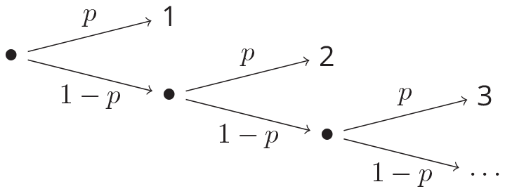

# Distributions

Created: 2024年12月8日 16:14
Class: COMS10014

# The Bernoulli and Binomial Distributions

## 伯努利实验 (Bernoulli Experiment)

### 定义和概念

伯努利实验是指每次实验只有两种可能的结果：**成功**和**失败**。

- 成功的概率是 $p$，失败的概率是 $1−p$。
- 期望值（即平均成功的概率）是 $p$。 $E=p$
- 方差（即成功和失败的分布波动程度）是 $p(1−p)$。 $\text{Var} = p(1 - p)$
- 示例 1
    
    ***假设你有 $N$ 个研究人员，每个研究人员独立地以概率 $p$ 成功完成任务，如果至少有一个人成功，整个任务就算成功。任务成功的概率是？***
    
    这种情况可以转换为一个伯努利实验，成功的概率是 $1 - (1 - p)^N$
    
    1. **任务失败的概率**：任务失败意味着所有 $N$ 个研究人员都失败了。每个研究人员失败的概率是 $1−p$，因为成功的概率是  $p$。
        
        因此，所有研究人员都失败的概率是：
        
        $\text{任务失败的概率} = (1 - p)^N$
        
    2. **任务成功的概率**：任务成功意味着至少有一个研究人员成功。由于任务成功的事件是“至少有一个成功”，所以任务成功的概率就是“1 减去任务失败的概率”：
        
        所以，最终的任务成功的概率为：
        
        $P(\text{任务成功}) = 1 - (1 - p)^N$
        
        假设有 $N=5$ 个研究人员，每个研究人员成功的概率是$p=0.3$，那么任务成功的概率是：
        
        $P(\text{任务成功}) = 1 - (1 - 0.3)^5 = 1 - 0.7^5 = 1 - 0.16807 = 0.83193$
        
        即任务成功的概率大约是 83.19%。
        
- 示例 2
    
    ***如果 N 个组件组成的系统，系统只有在所有组件都成功的情况下才算成功。例如，假设每个组件的成功概率是 0.95，14 个组件的系统成功的概率大约是 ？***
    
    1. **每个组件成功的概率**：每个组件的成功概率是给定的 $p=0.95$。
    2. **系统成功的条件**：系统成功的条件是**所有** N 个组件都必须成功。所以系统成功的概率就是所有 N 个组件都成功的概率。由于每个组件独立地成功，因此系统成功的概率是每个组件成功的概率的乘积：$P(\text{系统成功}) = p^N$
    3. **带入数值**：在这个案例中，$N=14，p=0.95$，所以：$(\text{系统成功}) = 0.95^{14} \approx 0.487$
    
    因此，14 个组件的系统成功的概率大约是 0.487，即 48.7%。
    

## 二项分布 (Binomial Distribution)

### 定义

二项实验是重复进行多个独立的伯努利实验。假设你有 $N$ 次独立的伯努利试验，每次试验成功的概率为 $p$。二项分布模型描述了在 $N$ 次试验中恰好得到 $k$ 次成功的概率。

$$
BINOM_N,p(k)=\binom{N}{k}p^k (1-p)^{N-k}
$$

- $\binom{N}{k}$是 从 N 次实验中选出 k 次成功 的组合数。
- $p^k$ 是每次成功的概率。
- $(1 - p)^{N - k}$ 是每次失败的概率。
- 期望值（成功的平均次数）是：$E=Np$
- 方差（成功次数的波动）是：$\text{Var} = Np(1 - p)$
- 示例 1
    
    ### **掷硬币的概率**
    
    假设你掷一个公平的硬币 10 次，求在这 10 次中恰好有 6 次是正面朝上的概率。
    
    ### **分析**：
    
    - 这是一个典型的二项分布问题。每次掷硬币，成功的概率（正面朝上的概率）是 $p=0.5$。
    - 你进行 10 次试验（掷硬币 10 次），所以 $N=10$。
    - 我们要求恰好有 6 次正面朝上的概率，即 $k=6$。
    
    ### **应用公式**：
    
    使用二项分布的公式：
    
    $P(X = 6) = \binom{10}{6} (0.5)^6 (0.5)^{10 - 6} = \binom{10}{6} (0.5)^{10}$
    
    首先，计算组合数：
    
    $\binom{10}{6} = \frac{10!}{6!(10 - 6)!} = \frac{10 \times 9 \times 8 \times 7}{4 \times 3 \times 2 \times 1} = 210$
    
    然后代入公式：
    
    $P(X = 6) = 210 \times (0.5)^{10} = 210 \times \frac{1}{1024} = \frac{210}{1024} \approx 0.205$
    
    因此，恰好有 6 次正面朝上的概率是约 **0.205**，即 20.5%。
    

# 几何分布 (Geometric Distribution)

## 定义

**几何分布**描述了一个重复伯努利实验，直到第一次成功为止。假设你每次尝试成功的概率是 p，那么几何分布给出的是直到第一次成功所需要的尝试次数 k 的概率。

公式为下：

$$
GEOM_p(k)=(1-p)^{k-1}p
$$

得到一次的几何分布的期望为$\frac1p$ 

方差为$\sigma^2=\frac{1-p}{p^2}$

一直实验直到成功的图示

- **示例 1**
    
    假设你掷一个公平的硬币，每次掷硬币，正面朝上的概率是$p=0.5$。
    
    假设你想知道第一次正面出现在第 3 次掷硬币时的概率，可以代入几何分布的公式：
    
    $P(X = 3) = (1 - 0.5)^{3 - 1} \times 0.5 = (0.5)^2 \times 0.5 = 0.125$
    
    因此，第一次正面出现在第 3 次掷硬币的概率是 **0.125**，即 12.5%
    

# Success, Failure or Continue

这是几何分布的变体，实验可以有三种结果：成功、失败或继续（即重复实验）。例如，掷两个六面骰子： 2 D6

- 如果点数和是 2 或 3，实验成功；
- 如果点数和是 10、11 或 12，实验失败；
- 其他结果需要继续掷骰子。

如果成功的概率是 $a$，失败的概率是 $b$，继续的概率是 $c$（其中 $a+b+c=1$），那么整体的胜率就是通过以下的无限系列表示：

$$
⁍
$$

**公式**说明：

- 每次实验有概率 a 成功，概率 c 继续尝试。
- 每次实验的结果必须是继续，直到最后一次才是成功或失败。

**最终的成功概率**是：

$$
w = \frac{a}{a + b}
$$

例如，如果掷骰子的规则是：

- 成功的概率 $a = \frac{3}{36}$（点数和为 2 或 3）；
- 失败的概率 $b = \frac{6}{36}$（点数和为 10、11 或 12）；
    
    则整体的成功概率 $w = \frac{3}{3 + 6} = \frac{1}{3}$
    

# 泊松分布 (Poisson Distribution)

## 定义

**泊松分布**适用于描述单位时间内稀有事件的发生次数。假设在某个时间段内事件的发生率是固定的，并且每个事件的发生是独立的。

## 公式

$$
POISSON_\lambda(k)=\frac{e^{-\lambda}\lambda^k}{k!}
$$

- $λ$ 是单位时间内的平均事件发生数。
- $k$ 是具体事件发生的次数。
- $e$ 是自然对数的底数（约等于 2.718）。
- 期望值：$E = \lambda$
- 方差：$\text{Var} = \lambda$
- 示例 1
    - 如果平均每小时钓到 1 条鱼（λ=1），那么 1 小时内钓到 0 条鱼的概率是：
        
        $P(X = 0) = e^{-1} \times \frac{1^0}{0!} \approx 0.368$
        
    - 如果在平均每小时钓到 1 条鱼的情况下，那么 1 小时内钓到 3 条鱼的概率是：
    $P(X = 3) = e^{-1} \times \frac{1^3}{3!} \approx 0.0613$
- 示例 2
    
    假设你经营一家商店，平均每小时接待 10 个顾客。你想知道，某一小时内接待 12 个顾客的概率是多少。
    
    ### **分析**：
    
    - $\lambda = 10$（每小时平均接待 10 个顾客）。
    - $k=12$（我们要求某一小时内接待恰好 12 个顾客的概率）。
    
    ### **应用泊松分布公式**：
    
    $P(X = 12) = \frac{10^{12} e^{-10}}{12!}$
    
    我们先计算 $12!$ 和 $10^{12} e^{-10}$：
    
    - $12!=479,001,600$
    - $10^{12} e^{-10} \approx 10^{12} \times 0.0000454 \approx 4.54 \times 10^7$
    
    代入公式计算：
    
    $P(X = 12) = \frac{4.54 \times 10^7}{479,001,600} \approx 0.0946$
    
    因此，在某一小时内接待 **12 个顾客** 的概率大约是 **0.0946**，即 9.46%。
    
- 示例 3
    
    假设你在医院工作，每小时接诊的病人数量服从泊松分布，平均每小时接诊 5 个病人。你想知道，在某一小时内接诊 **至少 3 个病人** 的概率是多少。
    
    ### **分析**：
    
    - $\lambda = 5$（每小时接诊 5 个病人）。
    - 我们要求至少接诊 3 个病人，即 $P(X≥3)$。
    
    ### **计算方法**：
    
    我们可以先计算在该小时内接诊少于 3 个病人的概率，即
    
     $P(X<3)=P(X=0)+P(X=1)+P(X=2)$，然后用补集求得至少 3 个病人的概率：
    
    $P(X \geq 3) = 1 - P(X < 3)$
    
    首先，计算 $P(X=0)、P(X=1)$ 和 $P(X=2)$：
    
    $P(X = 0) = \frac{5^0 e^{-5}}{0!} = e^{-5} \approx 0.0067$
    
    $P(X = 1) = \frac{5^1 e^{-5}}{1!} = 5e^{-5} \approx 0.0337$
    
    $P(X = 2) = \frac{5^2 e^{-5}}{2!} = \frac{25 e^{-5}}{2} \approx 0.0842$
    
    然后，求得 $P(X<3)$：
    
    $P(X < 3) = P(X = 0) + P(X = 1) + P(X = 2) = 0.0067 + 0.0337 + 0.0842 \approx 0.1246$
    
    因此，至少接诊 3 个病人的概率为：
    
    $P(X \geq 3) = 1 - 0.1246 = 0.8754$
    
    所以，在某一小时内接诊 **至少 3 个病人** 的概率是约 **0.8754**，即 87.54%。
    

# 累积分布 (Cumulative Distributions)

## 定义

累积分布是用于描述随机变量 $X$ 的累积概率的函数。它表示**小于等于某个特定值**的所有结果的总概率。换句话说，累积分布函数给出了随机变量的“累计概率”，即小于或等于某个值 $x$ 的所有事件发生的概率

设 X 是一个离散的随机变量，其概率质量函数（PMF）为 $p(x)$，那么累积分布函数 $C(x)$ 定义为：

$$
C(x) = P(X \leq x) = \sum_{\omega \leq x} p(\omega)
$$

这里，$C(x)$ 表示随机变量 $X$ 小于或等于某个特定值 $x$ 的概率。$\omega$ 表示随机变量 X 的取值范围（即所有可能的结果）

## 性质

1. **单调性**：累积分布函数 $C(x)$ 是单调不减的。也就是说，如果  $x_1 < x_2$，那么 $C(x_1) \leq C(x_2)$。这符合直觉：随着 $x$ 增大，累积的概率不会减少。
2. **取值范围**：对于任何随机变量 $X$，其累积分布函数的取值范围是从 0 到 1，即：
    
    $0≤C(x)≤1$对于所有的 $x$
    
    这意味着 $C(x)$ 表示的是概率，概率总和应该为 1
    
3. **边界条件**：
    - $C(x) \to 0$ 当 $x→−∞$，即对于极小的值，所有事件都比它大，概率为 0。
    - $C(x) \to 1$当 $x→+∞$，即对于极大的值，所有事件都小于或等于它，概率为 1。
4. **离散性**：对于离散随机变量，累积分布函数是一个阶梯函数，每次概率发生变化时，CDF 发生跳跃。
- 示例 1
    
    假设你掷一个公平的六面骰子，随机变量 $X$ 表示骰子的点数，可能的取值为 $\{1, 2, 3, 4, 5, 6\}$，且每个点数的概率是 $\frac{1}{6}$。
    
    累积分布函数 $C(x)$ 表示骰子点数小于或等于 $x$ 的概率。我们来逐个计算不同 $x$ 的累积分布值：
    
    - 当 $x = 1$ 时：
    
    $P(X \leq 1) = P(X = 1) = \frac{1}{6}, \ \text{所以 } C(1) = \frac{1}{6}.$
    - 当 x = 2 时：
    $P(X \leq 2) = P(X = 1) + P(X = 2) = \frac{1}{6} + \frac{1}{6} = \frac{2}{6}, \ \text{所以 } C(2) = \frac{2}{6}.$
    - 当 $x = 3$ 时：
    $P(X \leq 3) = P(X = 1) + P(X = 2) + P(X = 3) = \frac{1}{6} + \frac{1}{6} + \frac{1}{6} = \frac{3}{6}, \ \text{所以 } C(3) = \frac{3}{6}.$
    - 当  $x = 4$ 时：
    $P(X \leq 4) = P(X = 1) + P(X = 2) + P(X = 3) + P(X = 4) = \frac{1}{6} + \frac{1}{6} + \frac{1}{6} + \frac{1}{6} = \frac{4}{6}, \ \text{所以 } C(4) = \frac{4}{6}.$
    - 当 $x = 5$  时：
    $P(X \leq 5) = P(X = 1) + P(X = 2) + P(X = 3) + P(X = 4) + P(X = 5) = \frac{1}{6} + \frac{1}{6} + \frac{1}{6} + \frac{1}{6} + \frac{1}{6} = \frac{5}{6}, \ \text{所以 } C(5) = \frac{5}{6}.$
    - 当  $x = 6$ 时：
    $P(X \leq 6) = P(X = 1) + P(X = 2) + P(X = 3) + P(X = 4) + P(X = 5) + P(X = 6) = \frac{1}{6} + \frac{1}{6} + \frac{1}{6} + \frac{1}{6} + \frac{1}{6} + \frac{1}{6} = 1, \ \text{所以 } C(6) = 1.$
    
    这意味着骰子的累积分布函数为：
    
    - $C(1) = \frac{1}{6}$
    - $C(2) = \frac{2}{6}$
    - $C(3) = \frac{3}{6}$
    - $C(4) = \frac{4}{6}$
    - $C(5) = \frac{5}{6}$
    - $C(6) = 1$
