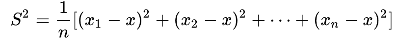

# Expected Values

Created: 2024年12月8日 10:10
Class: COMS10014

# Expected Value

我们投掷出一个D20 有以下结果

- 掷出 1：失去 3 金币
- 掷出 2、3、4：失去 2 金币
- 掷出 18、19：获得 1 金币
- 掷出 20：获得 6 金币

我们可以得到下面的这个概率分布表格

| $Ω$ | 1 | 2 | 3 | 4 | 5 | ... | 17 | 18 | 19 | 20 |
| --- | --- | --- | --- | --- | --- | --- | --- | --- | --- | --- |
| $p(ω)$ | 1/20 | 1/20 | 1/20 | 1/20 | 1/20 | ... | 1/20 | 1/20 | 1/20 | 1/20 |
| $G(ω)$ | -3 | -2 | -2 | -2 | 0 | ... | 0 | 1 | 1 | 6 |

| $x$ | -3 | -2 | 0 | 1 | 6 |
| --- | --- | --- | --- | --- | --- |
| $p_G(x)$ | 1/20 | 3/20 | 13/20 | 2/20 | 1/20 |

首先将随机变量的所有可能取值列出，然后计算每个值的概率，最后将值与它们的概率相乘并求和

## 定义

随机变量 $G$的期望值 $G :\rightarrow\Omega\rightarrow\mathcal G$ 在$\mathcal G\subseteq \mathbb{R}$ 

$$
E[G] = \sum_{\omega \in \Omega} p(\omega) \times G(\omega)
$$

也可以写成

$$
\sum_{a \in G} a \times p_G(a)
$$

在我们的例子中

期望值$E[G]$的计算为

$$
E[G] = \frac{1}{20} \times (-3) + \frac{3}{20} \times (-2) + \frac{2}{20} \times 1 + \frac{1}{20} \times 6 = -\frac{1}{20}
$$

这里的期望值是负的，意味着从长远来看，这个游戏对玩家不利。每次玩这个游戏，玩家平均会损失少量的金币

## 指示随机变量的期望值

指示随机变量F 是一个特殊的随机变量，它的取值只有 0 和 1，用来表示某个事件是否发生。对于事件S，F 在S 内取值 1，在其它地方取值 0。它的期望值就是事件S 发生的概率 P(S)

$$
E[F] = \sum_{\omega \in S} 1 \times p(\omega) + \sum_{\omega \in S} 0 \times p(\omega) = \sum_{\omega \in S} p(\omega) = P(S)
$$

# Expected Values of Functions

# 定义

如果 $f$是一个从样本空间 $\Omega$ 到实数集 $\mathbb{R}$ 的函数（也就是说， $f$ 是一个函数），那么公式的期望值可以通过以下公式计算：

$$
E[f] = \sum_{\omega \in \Omega} p(\omega) \times f(\omega)
$$

- $\Omega$是样本空间，包含所有可能的事件。
- $p(\omega)$是事件 $ω$ 发生的概率。
- $f(\omega)$是随机变量 $ω$ 对应的值（通过函数 f 转换后的值）。

## 示例

我们投掷一个 6 面骰子，事件 $\omega$代表每次投掷的结果，骰子的每一面出现的概率是均等的（即每个结果的概率 $p(\omega) = \frac16$。假设我们对骰子的结果取一个函数 $f(\omega) = \omega^2$，即我们关心的是每次投掷结果的平方。

那么，骰子的期望值 $E[f]$就是所有可能结果的平方与它们各自概率的加权和。

公式计算如下：

$$
⁍
$$

$$
E[f] = \frac{1}{6} \times (1 + 4 + 9 + 16 + 25 + 36) = \frac{91}{6} \approx 15.17
$$

# Variance 方差

**方差**是随机变量的一个重要特性，它衡量了随机变量取值的**离散程度**。如果方差较大，说明随机变量的值在较大的范围内波动；如果方差较小，说明随机变量的值较为集中

## 定义

对于随机变量 $G:Ω→\mathbb R$

**E[G]** 可以叫做“**均值**（mean）”或者“**第一矩**（first moment) 在统计学中期望值通常用$\mu$ 来表示

**二阶矩(**second moment)是指随机变量G 的平方的期望值$E[G^2]$

公式上，二阶矩可以表示为

$$
E[G^2] = \sum_{\omega \in \Omega} p(\omega) \times G(\omega)^2
$$

$\sigma ^2$方差是衡量随机变量的取值与期望值之间差距的平方的加权平均

公式上可以表示为

$$
\sigma ^ 2 = E[G^2]−(E[G])2
$$

也可以写成

$$
\sigma ^2=E[(G−μ)^2]
$$

<aside>
💡

$\sigma$被叫为标准差 standard deviation

</aside>

# The uniform distribution

## 定义

均匀分布是指一个随机变量在一个有限集合中，每个可能结果的概率都相等的分布，指的是对于集合 $\Omega \subset \mathbb{R}$中的每个元素 $\omega$，其概率为：$p(\omega) = \frac{1}{|\Omega|}$

其中$|\Omega|$是集合 $\Omega$ 中元素的个数，即 $\Omega$ 中有多少个可能的结果

## 期望

假设$\Omega = \{1, 2, 3, \dots, n\}$是从1到n 的一组整数，那么**均匀分布**上的期望值是这些整数的**算术平均数**。计算公式为

$$
E[G] = \frac{1}{n} \times \sum_{\omega=1}^n \omega =\frac {n+1}{2}
$$

## 方差

首先，计算每个值的平方的期望值 $E[G^2]$：

$$
E[G^2] = \frac{1}{n} \times \sum_{\omega = 1}^n \omega^2
$$

根据下面的求和公式：

$$

\sum_{\omega=1}^n \omega^2 = \frac{n(n+1)(2n+1)}{6}
$$

所以，平方的期望值可以表示为：

$$

E[G^2] = \frac{1}{n} \times \frac{n(n+1)(2n+1)}{6} = \frac{(n+1)(2n+1)}{6}
$$

接着，方差的公式：

$$

\text{Var}(G) = E[G^2] - (E[G])^2
$$

代入上面的 $(E[G^2])$和 $E[G]$的值可以计算：

$$

\text{Var}(G) = \frac{(n+1)(2n+1)}{6} - \left(\frac{n+1}{2}\right)^2
$$

化简后得到方差的表达式。

$$
Var(G)=\frac{n^2-1}{12}
$$

所以对于1~n的均匀分布 方差是$\frac{n^2-1}{12}$

# Linearity of Expectation

### **1. 期望值的加法线性（$E[A+B]=E[A]+E[B]$）**

两个随机变量 A和 B的和的期望值，等于这两个随机变量期望值的和。

**加法线性** 意味着我们可以将期望值的计算拆开，分别计算 A 和  B 的期望值，然后相加。
如果我们有两个随机变量 A 和 B，那么它们的和（如 A+B）的期望值就是它们各自期望值的和。这个结果不需要随机变量之间存在独立性，它适用于所有随机变量。

**公式**：

$$
E[A + B] = E[A] + E[B]
$$

### **2. 常数乘法线性（$E[c \times A] = c \times E[A]$）**

这一条是期望值的常数乘法线性性质。它表明如果一个随机变量 A 乘以常数 c，那么其期望值就等于常数 c 乘以原随机变量 A 的期望值。

如果我们对一个随机变量进行缩放（乘以常数），期望值也会相应地缩放。无论是放大还是缩小，期望值会按比例变化。

**公式**：

$$
E[c \times A] = c \times E[A]
$$

这里 c 是一个常数，A 是一个随机变量。

### **3. 线性组合的期望值（$E[S] = \sum_i c_i \times E[R_i]$）**

这一条是期望值在**线性组合**下的性质。它表明如果我们有一个随机变量的线性组合（即多个随机变量与常数的乘积之和），那么其期望值等于每个随机变量的期望值与常数的乘积之和。

- **线性组合**的形式是：$S = \sum_i c_i \times R_i$，其中 $R_i$ 是随机变量，$c_i$ 是常数。
- 期望值的计算可以拆分成对每个随机变量的期望值的加权求和。

**公式**：

$$
E[S] = E\left[ \sum_i c_i \times R_i \right] = \sum_i c_i \times E[R_i]
$$

# 示例

有一个班级，班级里有 N 个学生，每个学生提交了一份作业。老师将作业随机地分发回给学生，每个学生都会拿到一份作业，但不一定是自己的。问题要求我们计算在这种随机分配的情况下，**平均有多少学生能拿回自己的作业**。

### **1. 关键概念：指示随机变量**

首先，使用**指示随机变量**（indicator random variables）来简化这个问题。对于每个学生 i（其中 $i \in \{1, \dots, N\}$），我们定义一个指示变量 $S_i$：

$S_i = 
\begin{cases} 
1, & \text{如果事件 \(i\) 在第一个时间内发生}, \\
0, & \text{如果事件 \(i\) 在第一个时间内未发生}
\end{cases}$

这个指示变量 $S_i$ 表示**第 $i$ 个学生是否拿回了自己的作业**：

- 如果学生  拿回了自己的作业，。
    
    $S_i = 1$
    
- 如果学生  没有拿回自己的作业，。
    
    $S_i = 0$
    

通过这种方式，问题变得更加结构化，我们将每个学生拿回自己作业的事件转换成了一个二值事件，即 $S_i$ 为 0 或 1。

### **2. 总共有多少学生拿回自己的作业**

我们关心的是**总共有多少个学生拿回了自己的作业**，即我们需要计算所有 $S_i$ 的和：

$S = \sum_{i=1}^{N} S_i$

这表示所有学生拿回自己作业的总数。因为每个 $S_i$ 都是 0 或 1，所以 S 就是所有学生中拿回自己作业的学生的数量。

### **3. 如何计算期望值**

为了计算**平均有多少学生拿回自己的作业**，我们需要计算 
$$ 的期望值。根据期望值的线性性质：

$$
E[S] = E\left[ \sum_{i=1}^{N} S_i \right] = \sum_{i=1}^{N} E[S_i]
$$

这一步利用了**期望值的线性性质**，即“求和的期望等于每个期望值的和”。即使这些随机变量（$S_i$）是**不独立**的，期望值的线性性质依然成立。

### **4. 计算每个 $S_i$ 的期望值**

现在，我们计算每个 $S_i$ 的期望值 $E[S_i]$。因为 $S_i$ 是一个**指示随机变量**，它的期望值就是事件发生的概率。所以，$S_i = 1$（即学生 $i$ 拿回自己作业）的概率是 $1/N$，因为所有的作业是随机分发的，因此每个学生拿回自己作业的概率是 $1/N$。

因此：

$E[S_i] = \frac{1}{N}$

### **5. 总期望值**

由于每个 $E[S_i] = 1/N$，我们可以将它们相加：

$$
E[S] = \sum_{i=1}^{N} E[S_i] = \sum_{i=1}^{N} \frac{1}{N} = N \times \frac{1}{N} = 1
$$

这意味着，不论班级的大小（即 N 的值），**平均而言**，每次作业分发后，**总是有 1 个学生**拿回了自己的作业。

# Products and Variances

$我们想知道它们乘积的期望值

E[A×B] 如何与各自的期望值

E[A] 和
E[B] 相关$

- 如果 A 和 B 是**独立的**随机变量，那么有一个非常简单的结论：E[A×B]=E[A]×E[B]
    
    也就是说，独立随机变量的乘积的期望值，等于它们期望值的乘积。
    
- **如果 A 和 B 不是独立的**，那么我们不能直接将期望值拆开，需要使用更复杂的计算方法

假设 A  和 B 都是离散的随机变量，它们的取值分别为  $a_1, a_2, \dots, a_n  和  b_1, b_2, \dots, b_m$ 。我们可以将 A 和  B 分别表示为指示变量的线性组合。

- 对于 A 我们有
    
    $$
    A(\omega) = \sum_{i=1}^n a_i \times X^A_i(\omega)
    $$
    

其中， $\chi_i^A(\omega)$  是指示变量，当  $A(\omega) = a_i$  时， $\chi_i^A(\omega) = 1$ ，否则为 0。

- 对于 B

$$
B(\omega) = \sum_{j=1}^m b_j \times X^B_j(\omega)
$$

其中， $\chi_i^B(\omega)$  是指示变量，当  $B(\omega) = b_i$  时， $\chi_i^B(\omega) = 1$ ，否则为 0。

然后，我们可以展开 $A \times B$ 

$$
A \times B (\omega) = \left( \sum_{i=1}^n a_i \times X^A_i(\omega) \right) \times \left( \sum_{j=1}^m b_j \times X^B_j(\omega) \right)
$$

$$
E[A \times B] = \sum_{i=1}^n \sum_{j=1}^m a_i b_j E[X^A_i X^B_j]
$$

<aside>
💡

这几分不要了… 跳过

</aside>

# The binomial distribution

二项分布描述了在𝑁次独立实验中，成功的次数。每次实验有两个可能的结果：成功或失败。成功的概率是𝑝，失败的概率是 $1−p$

$BINOMN,p(x)$ is the probability of getting x successes in $N$ independent experiments, each of which has probability $p$ of succeeding. It has expected value $N × p$ and variance $N × p × (1 − p)$

<aside>
💡

二项分布期望为 $N\times p$    方差为$N × p × (1 − p)$

</aside>

# 几何分布 Mean Time To Failure (MTTF)

首先，我们考虑一个实验，每次实验成功的概率是$p$，失败的概率是$1 - p$。我们要计算第一次成功所需的实验次数

- 第一次就成功的概率是 p。
- 第二次成功的概率是：第一次失败（概率 $1−p$），第二次成功（概率 $p$）。因此，概率是 $(1−p)×p$。
- 第三次成功的概率是：前两次都失败（概率 $(1−p)^2$），第三次成功（概率 $p$）。因此，概率是 $(1−p)^2×p$。
- 一般来说，第 n 次成功的概率是 $(1−p)^{n−1}×p$

这表示成功的次数 n 是第n 次才发生的，它的概率分布符合几何分布

<aside>
💡

得到一次的几何分布的期望为$\frac1p$ 方差为$\sigma^2=\frac{1-p}{p^2}$

</aside>

$\frac1p$表示**平均需要进行 $\frac{1}{p}$次实验才能得到第一次成功**。这就是**平均故障时间**（MTTF），即在这个过程中，期望的运行次数

如果每次实验成功的概率是p，那么**平均而言**，需要进行$\frac{1}{p}$次实验才能得到第一次成功

比如，如果每次实验成功的概率是0.25（例如掷一个公平的四面骰子，其中一个面代表成功），那么期望需要掷 4 次才能第一次成功

# Conditional Expectation

## 定义

如果我们有一个随机变量 $X$，条件期望 $E[X | A]$ 表示在给定事件$A$ 发生的条件下，随机变量 $X$ 的期望值。

公式：

$$
E[X|A] = \sum_{x \in X} x \cdot P(X = x | A)
$$

其中：

- X 是随机变量。
- A 是已知的条件事件。
- $P(X = x | A)$ 是在事件 $A$ 发生的条件下，$X$ 取值为 $x$ 的条件概率。

## 示例

假设我们掷一个六面骰子，随机变量 $X$ 表示掷出的点数。现在，我们知道骰子的点数大于 3，即 $A={4,5,6}$，求条件期望 $E[X∣A]$，即在 $A$ 条件下掷出骰子的平均点数。

1. 原始样本空间 $Ω={1,2,3,4,5,6}$。
2. 条件事件 $A={4,5,6}$，条件概率为：
$P(X=4∣A)=P(X=5∣A)=P(X=6∣A)=\frac13$
这表示在条件事件 A 下，骰子掷出 4、5、6 的概率是相等的，且每个事件的概率为 $\frac13$。
3. 条件期望为：
    
    $E[X | A] = 4 \cdot \frac{1}{3} + 5 \cdot \frac{1}{3} + 6 \cdot \frac{1}{3} = \frac{4 + 5 + 6}{3} = 5$
    

因此，在已知骰子点数大于 3 的条件下，期望点数为 5。
