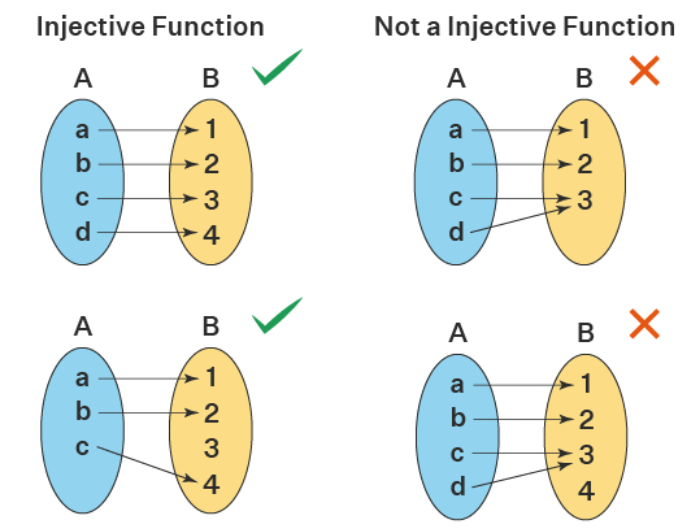

# Functions

Created: 2024年11月24日 12:36
Class: COMS10014

# Definition of Functions

## 定义

对于非空集合$A$和$B$，从$A$到$B$的函数是$A×B$的一个子集，其中集合$A$中的每个元素$a$在这个子集中恰好以$(a, b)$的形式出现一次。这里的A是函数的(定义域)，B是函数的范围(值域)

<aside>
💡

We call A the **domain** of the function, and B the **range** (or codomain) of the function

</aside>

## 例如

函数$f$定义如下：域$A = \{0, 1, 2, 3\}$，范围$B = Z$（整数集），公式为$f(x) = 2x - 1$。我们可以将这个函数表达为一个表格或一组有序对的集合

$$
\begin{array}{c|cccc}
x & 0 & 1 & 2 & 3 \\
\hline
f(x) & -1 & 1 & 3 & 5 \\
\end{array}
$$

$$
f = \{(0, -1), (1, 1), (2, 3), (3, 5)\}
$$

# Arrow Notation

在数学中，我们常用“$f : A → B$”来表示函数$f$，其域为$A$，范围为$B$。这种箭头（$→$）实际上是一个在集合之间构建新集合的操作

对于集合$A$和
$B$，“$A → B$”表示从A到B的所有函数的集合。如果$A$或$B$是空集，那么函数集也是空的

# Injective, Surjective, and Bijective

函数可以有三种特殊的类型，取决于它如何连接域和范围中的元素

## Injective 单射

如果$B$中的每个元素最多只在一对$(a, b)$中作为$b$出现一次

对于所有的$x$和$y$属于$A$（函数的域），如果$f(x) = f(y)$，则必须有$x = y$。这表明如果输出相同，则其输入也必须相同

As formulas, a function $f \in A \to B$ is injective if

$$
\forall x, y \in A. \, \big(f(x) = f(y) \to x = y\big)
$$

$$
\forall x, y \in A. \, \big(x \neq y \to f(x) \neq f(y)\big)
$$

### 示例

函数 $f : R → R$ 定义为 $f(x) = 2x + 1$

在这个例子中，每一个不同的实数输入$x$都会映射到一个唯一的输出$y$。即使我们取任意两个不同的输入$x₁$和$x₂$，其中$x₁ ≠ x$₂，它们的输出也不会相同

<aside>
💡

**Injective 单射** 简单来说就是 每一个$x$自变量都对应不同的
$y$函数值 不同的变量不能对应到一个函数值 **也就是在坐标系中画 横着的线 ($y=n$) 只能与函数有一个交点**

</aside>

## Surjective 满射

如果B中的每个元素至少在一对(a, b)中作为b出现一次

As formulas, a function $f \in A \to B$ is Surjective if

$$
\forall b \in B. \, \exists a \in A. \, f(a) = b
$$

### 示例

函数 $g : R → R+$ 定义为 $g(x) = e^x$

在这个例子中，每一个正实数（$R+$表示正实数集）都可以作为输出被函数 $g$ 的某个输入所达到。对于陪域R+中的任何y，我们总能找到域$R$中的一个$x$，使得 $e^x = y$。这个x可以通过取对数得到

$x=ln(y)$

因此，无论我们选择R+中的哪个正数y，总有一个x值使得$e^x = y$。所以，函数 $g$ 是满射的

<aside>
💡

**Surjective 满射** 简单来说就是 每个y 都至少有一个 x 对应过去

在图像上每一根竖线都必须至少穿过图像一次

</aside>

## Bijective 双射

同时是单射和满射，即B中的每个元素恰好出现一次

### 示例

函数 $h : Z → Z$ 定义为 $h(x) = x + 3$

这个函数将整数集Z中的每一个整数$x$映射到整数$x + 3$。这个映射既是单射（因为每个不同的输入$x$产生一个唯一的输出$y$），也是满射（因为对于陪域$Z$中的任何整数$y$，总存在一个整数$x = y - 3$，使得 $h(x) = y$）

因此，每一个整数都有一个唯一的前身$（x - 3）$，而每个输出也都是唯一的。这使得函数 $h$  是一个双射

<aside>
💡

每个$x$对应一个唯一$y$，且每个$y$都有一个唯一的$x$对应

Bijective的图像是 每一条横线唯一经过图像一次 并且每一条竖线也都唯一经过图像一次

</aside>

# Arrow Diagrams

箭头图是一种可视化函数的方法。图中$A$的每个元素通过一条箭头指向$B$的一个元素。如果一个函数不是单射，则$B$中至少有一个元素有多条箭头指向它；如果不是满射，则至少有一个$B$中的元素没有箭头指向它

## 示例

$A = \{1,2,3,4\}, B = \{1,2,3\}$

$f = \{(1,1),(2,1),(3,1),(4,2)\}$

$$
\begin{array}{c|cccc}
x & 1 & 2 & 3 & 4 \\
\hline
f(x) & 1 & 1 & 1 & 2 \\
\end{array}
$$

This function is not injective, as $1 ∈ B$ has more than one arrow coming in, nor is it surjective as $3 ∈ B$ has no arrow coming in

# Inverses

## 定义

如果一个函数是双射，我们可以定义它的逆函数，逆函数的箭头方向与原函数相反。只有当原函数是双射时，逆函数才存在

If $f ∈ A → B$ is a **bijective** function, then its inverse $f^{(−1)} ∈ B →A$ is the function $\{(b,a) | (a,b) ∈ f\}$ or equivalently

$$
\forall a \in A, \forall b \in B. \, \big(f(a) = b \leftrightarrow f^{-1}(b) = a\big)
$$

## 示例

if $f ∈ Z → Z$ with $f(z) = z +1$

 $f =\{...,(−2,−1),(−1,0),(0,1),(1,2),(2,3),...\}$

$f^{(−1)} = \{...,(−1,−2),(0,−1),(1,0),(2,1),(3,2),...\}$

So,  $f^{(−1)}(z) = z −1$

<aside>
💡

反函数就是把 $x$ 和 $y$ 的位置交换 算出新的 $y$ 表达式

</aside>

# Preimage

## 定义

如果$f \in A \to B$ 是一个函数 ， 逆像是指：给定 $B$中的一个元素 $b$，找出A中所有映射到 $b$ 的元素集合。这个集合被称为 $b$ 的逆像，用 $f^∗(b)$表示。 那么$f^* \in B \to \mathcal{P}(A)$其中$f^*(b) = \{a \in A \mid f(a) = b\}$叫做$f$函数的Preimage 原像

## 示例

假设有一个函数$f: \{1, 2, 3, 4\} \to \{1, 2, 3\}$ 函数关系满足

$f(1) = 1 \\
f(2) = 1 \\
f(3) = 1 \\
f(4) = 2$

原像Preimage函数的结果如下

$f^*(1) = \{1, 2, 3\} \, \text{— 因为 1, 2, 3 都被映射到 1。}$

$f^*(2) = \{4\} \, \text{— 因为只有 4 被映射到 2。}$

$f^*(3) = \emptyset \, \text{— 因为没有元素被映射到 3。}$

# Image

在函数$f: A \rightarrow B$中，函数的“Image”是指函数实际能达到的值域$B$中的元素集合。这可以有两种不同的描述方式

$$
\{f(a) \mid a \in A\}
$$

$$
\{b \in B \mid \exists a \in A, f(a) = b\}
$$

## 示例

假设有一个函数$f: \mathbb{Z} \to \mathbb{Z}$ 定义为 $f(z) = 2z$ 函数$f$的像就是所有偶数的集合，因为任何整数乘以2都会得到一个偶数 所以，像可以表达为

$$
\{f(z) \mid z \in \mathbb{Z}\} = \{2z \mid z \in \mathbb{Z}\}
$$

例如在上述函数中，元素2的像是4 因为$f(2) = 4$

# Composing Functions

## 定义

当我们有两个函数$f$和$g$时，可以将它们组合成一个新的函数$h = f ◦ g$，意味着先应用$f$，再应用$g$

 $h(a) = g(f(a))$  

<aside>
💡

其实 是不对的 正确来说  $h = f ◦ g$        $h(x)= f(g(x))$但是不知道他们哪个老师搞反了 所以考试的时候要反着来  

</aside>

## 性质

- Composing two (or more) **injective** functions gives another **injective** function.
    
    将两个（或更多）**单射**函数组合后，仍然是一个**单射**函数
    
    - 如果$f(a)=f(b)$蕴含$a=b$，则函数$f$是单射。
    - $f(x)=2x$，定义域为实数集$\R$
    - $g(x)=x+1$，定义域同上
    - 组合：$h(x)=g(f(x))=2x+1$
    - 验证：如果$h(a)=h(b)$，即$2a+1=2b+1$，推出$a=b$
- Composing two (or more) **surjective** functions gives another **surjective** function.
    
    将两个（或更多）**满射**函数组合后，仍然是一个**满射**函数
    
    - 如果对于函数$f$的每个值域$y$，都存在一个定义域中的$x$满足$f(x)=y$，则$f$满射。（y可以用一个x有关式子表达）
    - $f(x)=x+1$，定义域和值域均为$\R$
    - $g(x)=2x$，定义域和值域均为$\R$
    - 组合：$h(x)=g(f(x))=2(x+1)=2x+2$
    - 验证：对于任意$y∈R$，令$x = \frac{y - 2}{2}$，可以找到$x$满足$h(x)=y$
- Therefore, composing **bijective** functions must give another **bijective** function.
    
    因此，将**双射**函数组合后，必然仍然是一个**双射**函数。
    
    - 不举例了好累

# Cardinality

假设我们有两个集合A和B，并且想要知道从A到B的所有可能函数的数量。如果集合A和B都是有限集，函数的总数可以通过以下方式计算

$$
|A \to B| = |B|^{|A|}
$$

## 示例

假设有两个集合，集合A有3个元素，集合B有2个元素，即A = {a, b, c} 和 B = {0, 1}。根据基数的定义，从A到B的所有可能的函数数量是

$|A \to B| = |B|^{|A|} = 2^3 = 8$

分别是

1. **所有元素映射到0**：
    
     $f(a) = 0, f(b) = 0, f(c) = 0$ 
    
2. **所有元素映射到1**：
    
    $f(a) = 1, f(b) = 1, f(c) = 1$
    
3. **两个元素映射到0，一个元素映射到1**：
    
    $f(a) = 0, f(b) = 0, f(c) = 1 \\
    f(a) = 0, f(b) = 1, f(c) = 0 \\
    f(a) = 1, f(b) = 0, f(c) = 0$
    
4. **两个元素映射到1，一个元素映射到0**：
$f(a) = 0, f(b) = 1, f(c) = 1 \\
f(a) = 1, f(b) = 0, f(c) = 1 \\
f(a) = 1, f(b) = 1, f(c) = 0$

# Difference between the Range and the Image

The **range** of a function is part of its definition, and is all elements that it can potentially reach. 

函数的Range是其定义的一部分，是它可能到达的所有元素

The **image** of a function is all elements that it can actually reach. 

函数的Image是它实际可以到达的所有元素

For example, for

$$
 ⁍
$$

the **range** is the natural numbers

Range 是所有自然数

but the **image** is the even natural numbers. 

Image 是所有偶自然数

A function where the **range is equal to the image** is a **surjective** function.

Range和Image完全相等的函数是一个满射函数
