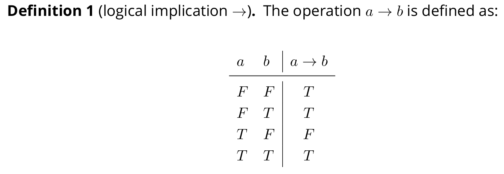

# Logic

Created: 2024年11月22日 22:38
Class: COMS10014

# Propositions 命题

命题是指任何可以判断为真实或虚假的陈述。这种陈述不包括疑问句、感叹句或不明确的表达，因为这些无法判断其真假性

# Propositional Logic

除了数字，只有两个值叫做T（真）和F（假）。一些书上也把它们写成1和0。这组值通常写成 B “布尔运算” 这不是通常的加法，乘法等，而是有一套新的逻辑操作

我们不会用T和F作为变量名字 因为他们已经代表了 True 和 False

# Implication: if ...then

逻辑蕴含，记作 $a \rightarrow b$，并读作“如果 a 那么 b”，是一种表达命题间条件关系的逻辑操作。这种关系表明：如果第一个命题 a 为真，则第二个命题 b 也必须为真

当 a 为假时，无论 b 为何值，蕴含 $a \rightarrow b$ 总是为真。这是因为在逻辑中，从一个假命题推出任何命题都被认为是正确的

当 a 为真且 b 也为真时，蕴含 $a \rightarrow b$ 为真

唯一使得 $a \rightarrow b$ 为假的情况是 a 为真而 b 为假。在这种情况下，因为 b 没有满足预期的真值，所以蕴含不成立

真值表如下

# Truth Tables

我们可以通过列真值表来判断两个表达式是否为等价的

例如要判断$(a \rightarrow b) \rightarrow c和 a \rightarrow (b \rightarrow c)$ 是否等价

$(a \rightarrow b) \rightarrow c$ 的真值表

那么列出两个表达式的真值表

 $a \rightarrow (b \rightarrow c)$ 的真值表

我们可以看到$(a \rightarrow b) \rightarrow c和 a \rightarrow (b \rightarrow c)$ 的真值表结果是不一样的

所以

# Two-sided Implication 双向蕴含 当且仅当

双向蕴含，表示为

$a \leftrightarrow b$，通常读作 "a 当且仅当 b"。这种关系指出两个命题a 和 b 必须具有相同的真值状态，即两者要么同时为真，要么同时为假，才使得$a \leftrightarrow b$为真

$a \leftrightarrow b$ 的真值表

# And, Or, Not

## logical negation ¬ 逻辑非

**$¬a的真值表$**

## 逻辑与（AND）∧ , 逻辑或（OR）∨ , 逻辑异或（XOR）⊕

$a∧b, a∨b, a⊕b的真值表$

## precedence of logical operators 逻辑运算的优先级

1. **逻辑非（$NOT, ¬$）**：具有最高的优先级。这意味着在逻辑表达式中，首先解析所有的逻辑非操作。
2. **逻辑与（$AND, ∧$）**：优先级低于逻辑非。当表达式中同时存在逻辑非和逻辑与操作时，先对逻辑非进行操作，然后执行逻辑与。
3. **逻辑或（$OR, ∨$）**：优先级低于逻辑与。在没有括号明确分组的情况下，逻辑或操作通常在逻辑与之后执行。
4. **逻辑蕴含（$→$）**：优先级低于逻辑或。这是因为蕴含常常构建在其他基本操作（如逻辑与或逻辑或）的基础之上。
5. **双向蕴含（$↔, iff$）**：具有最低的优先级。当逻辑表达式中涉及到多种操作时，双向蕴含通常最后执行。
    
    例如
    
    表达式 $\neg a \lor b \land c$ 根据优先级规则解读为 $(\neg a) \lor (b \land c)$
    

# Laws of Logic

### 1. 恒等律（Identity Laws）

- **与真相等（Identity for AND）**：
$a \land \text{T} \equiv a$
这表示一个命题与真值“真”进行逻辑与运算，结果仍然是该命题的原始真值。
- **或假相等（Identity for OR）**：
$a \lor \text{F} \equiv a$
这表示一个命题与真值“假”进行逻辑或运算，结果仍然是该命题的原始真值。

### 2. 支配律（Domination Laws）

- **与假相等（Domination for AND）**：
$a \land \text{F} \equiv \text{F}$
任何命题与“假”进行逻辑与运算，结果总是“假”。
- **或真相等（Domination for OR）**：
$a \lor \text{T} \equiv \text{T}$
任何命题与“真”进行逻辑或运算，结果总是“真”。

### 3. 幂等律（Idempotent Laws）

- **与幂等（Idempotent for AND）**：
$a \land a \equiv a$
命题与其自身进行逻辑与运算，结果仍是该命题。
- **或幂等（Idempotent for OR）**：
    
    $a \lor a \equiv a$
    命题与其自身进行逻辑或运算，结果仍是该命题。
    

### 4. 否定律（Negation Laws）

- **双重否定（Double Negation）**：
$¬(¬a)≡a$
一个命题的否定的否定还是该命题。

### 5. 交换律（Commutative Laws）

- **与交换律（Commutative for AND）**：
$a \land b \equiv b \land a$
- **或交换律（Commutative for OR）**：
$a \lor b \equiv b \lor a$
两个命题进行逻辑与或逻辑或运算时，可以互换顺序。

### 6. 结合律（Associative Laws）

- **与结合律（Associative for AND）**：
$(a \land b) \land c \equiv a \land (b \land c)$
- **或结合律（Associative for OR）**：
$(a \lor b) \lor c \equiv a \lor (b \lor c)$
多个命题进行逻辑与或逻辑或运算时，组合顺序可以自由变换。

### 7. 分配律（Distributive Laws）

- **与对或的分配（Distributive of AND over OR）**：
$a \land (b \lor c) \equiv (a \land b) \lor (a \land c)$
- **或对与的分配（Distributive of OR over AND）**：
$a \lor (b \land c) \equiv (a \lor b) \land (a \lor c)$
逻辑与和逻辑或在多个命题间的分配方式。

### 8. DeMorgan's Laws（德摩根定律）

- **对与的否定（Negation of AND）**：
$\neg(a \land b) \equiv \neg a \lor \neg b$
- **对或的否定（Negation of OR）**：
$\neg(a \lor b) \equiv \neg a \land \neg b$
这些定律说明如何将一个复杂命题的否定分解为更简单的部分的否定。

# Law of the Excluded Middle

被排除中间法则声明，对于任何逻辑命题A，它要么是真（T），要么是假（F），不存在中间状态或其他可能性

对于任何逻辑A, 我们有 $A∨¬A≡T$ 和 $A∧¬A≡F$
