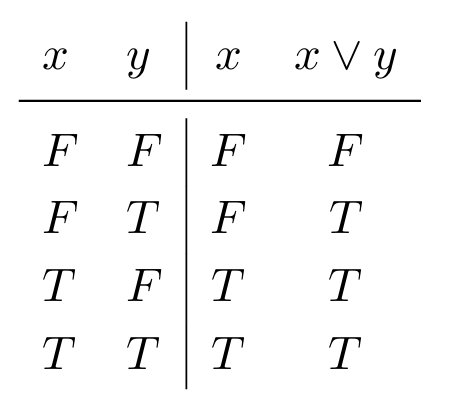

 # More Logic

Created: 2024年11月22日 23:20
Class: COMS10014

# Satisfiability

一个逻辑公式可以分为三种情况：

- **重言式 (Tautology)：** 在所有变量赋值下都为真。例如：$T$ 和 $x∨¬x$
- **矛盾式 (Contradiction)：** 在所有变量赋值下都为假。例如：$F$ 和 $x∧¬x$
- **偶然式 (Contingency)：** 既有赋值下为真，也有赋值下为假。例如：$x$

所以每个公式都是上述三种情况中的一种，但也有一些更多相关定义

- **可满足 (Satisfiable)：** 存在至少一种变量赋值使公式为真。
- **不可满足 (Unsatisfiable)：** 无法找到使公式为真的变量赋值

<aside>
💡

重言式(**Tautology)**和偶然式(**Contingency)**都属于可满足(**Satisfiable)**公式

矛盾式**(Contradiction)**等价于不可满足**(Unsatisfiable)**公式

</aside>

# Entailment

如果公式A 蕴涵公式B，记作 $A \models B$，表示：

- **在所有赋值中，若 A 为真，则 B 必为真**。
- $A \models B$是一种陈述，不是公式

我们可以说 $x \models x \lor y$

因为真值表

例如

$x⊨x∨y$，因为无论 x 的值是什么，$x∨y$ 都成立。
$x \wedge y \models x$和 $x \wedge y \models y$，但$x \vee y \not\models x$，因为 $x \vee y$可能仅因 y 的值而为真。

# More on Implication

- 对于 $A \to B$：
    - **前件 (Antecedent)：** $A$
    - **后件 (Consequent)：** $B$
- **相关定义：**
    - **逆命题 (Converse)：** $B \to A$
    - **否命题 (Inverse)：** $\neg A \to \neg B$
    - **逆否命题 (Contrapositive)：** $\neg B \to \neg A$

$A \to B$

 $B \to A$

$\neg A \to \neg B$

$\neg B \to \neg A$

的真值表如右图

<aside>
💡

逆命题**(Converse)**和否命题**(Inverse)**等价，但与原命题不等价

逆否命题**(Contrapositive)**与原命题等价

</aside>

# Completeness and Soundness

- **完备性**Completeness**：**
    - 规则系统是完备的，若对于任何 $A⊨B$，都可以通过规则推导 $A⊢B$。
- **正确性**Soundness**：**
    - 规则系统是正确的，若 $A⊢B$ 必然意味着 $A⊨B$。

# Functional Completeness

- **定义：**
    - 一个操作集是功能完备的，若任何公式都可以用该集合的操作表示。
- **例子：**
    - $\{\wedge, \vee, \neg\}$是功能完备的。
    - 公式的转换：
        - $x \oplus y \equiv (x \wedge \neg y) \vee (\neg x \wedge y)$
        - $x \to y \equiv \neg x \vee y$

# Normal Forms

## DNF **析取范式 disjunctive normal form**

一个公式是多个“与”组合，再用“或”连接

- 用真值表找出公式为真  $T$ 的行 相与∨。
- 每行生成一个子公式，将所有子公式用“或”连接∧

## CNF **合取范式 conjunctive normal form**

用“与”连接多个“或”子公式

- 用真值表找出公式为假 $F$ 的行 相或∧。
- 每行生成一个子公式，将所有子公式用“与”连接∨

# More on DNF

如果两个子句仅在一个变量的符号（取反或不取反）上不同，则可以合并这两个子句，并去掉该变量：

- **规则：**$(x \wedge B) \vee (\neg x \wedge B) \equiv B$
    - B 是其余变量的结合。
    - 合并后的公式覆盖了两行的真值。
- **数学推导：$(x∧B)∨(¬x∧B)≡(x∨¬x)∧B≡T∧B≡B$**
这里用到了：
    - **分配律（反向）：**$P \wedge (Q \vee R) \equiv (P \wedge Q) \vee (P \wedge R)$
    - **排中律：** $x \vee \neg x \equiv T$
    
    例如
    
    - 初始公式：
    $(x \wedge y) \vee (\neg x \wedge y) \vee (\neg x \wedge \neg y)$
    - 第一步合并：
    $(x \wedge y) \vee (\neg x \wedge y)$ : 提取 $y$
        1. $((x \vee \neg x) \wedge y) \vee (\neg x \wedge \neg y)$ 👇
        2. $(T\wedge y)\vee(\neg x \wedge \neg y)$
        3. $y \vee (\neg x \wedge\neg y)$
    - 简化后的公式是：
    $y \vee (\neg x \wedge \neg y)$

## **示例**

### 例如

| x | y | z | A |
| --- | --- | --- | --- |
| F | F | F | F |
| F | F | T | *T* |
| F | T | F | F |
| F | T | T | F |
| T | F | F | F |
| T | F | T | *T* |
| T | T | F | F |
| T | T | T | F |

### 步骤

1. 找出 $A=T$ 的行：
    - 第二行：$x=F,y=F,z=T$。
    - 第六行：$x=T,y=F,z=T$。
2. 构造对应子句： 如果是T则保留原变量 若是F则在原变量前加 $\neg$
    - 第二行对应 $\neg x \wedge \neg y \wedge z$
    - 第六行对应 $x \wedge \neg y \wedge z$
3. 合成公式：把每一行用$\vee 连接$ $\;A \equiv (\neg x \wedge \neg y \wedge z) \vee (x \wedge \neg y \wedge z)$
4. 优化：
    - 提取公共部分$\neg y \wedge z$
        
        $A \equiv (\neg y \wedge z)$
        

最终得到的公式 $A \equiv (\neg y \wedge z)$ 是最简的 DNF 表达式。

<aside>
💡

CNF就是找出所有结果为$F$的项之间相$\vee$得到的每一行相$\wedge$

</aside>

# NAND and NOR

NAND ($\uparrow$) 和 NOR ($\downarrow$) 是功能完备的

$a \uparrow b$
$a \downarrow b$ 

的真值表如图

## 用Nand推导别的逻辑运算的公式

$$
⁍
$$

$$
x\land y\equiv \lnot(x\uparrow y)\equiv (x\uparrow y)\uparrow (x\uparrow y)
$$

$$
x\lor y\equiv \lnot x \uparrow \lnot y \equiv (x \uparrow x)\uparrow (y \uparrow y)
$$

$$
x \oplus y\equiv(x \land\lnot y)\lor(\lnot x\land y)
$$

## 用Nor推导别的逻辑运算的公式

$$
¬x≡x↓x
$$

$$
x∨y≡¬(x↓y)≡(x↓y)↓(x↓y)
$$

$$
x∧y≡¬x↓¬y≡(x↓x)↓(y↓y)
$$

$$
x⊕y≡((x↓x)↓(y↓y))↓(x↓y)
$$
