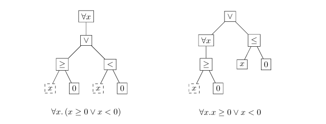

# Predicates

Created: 2024年11月23日 19:43
Class: COMS10014

# Free Variables

## 定义

自由变量是指在一个表达式中没有被量词（如全称量词“∀”或存在量词“∃”）约束的变量。

## 例子

考虑表达式 "n is even"（n是偶数）。这里，n 就是一个自由变量，因为它可以取任何整数值。只有当我们给n赋予一个具体的值，比如2、4、6等，这个命题才能确定为真；如果赋值为1、3、5等，命题则为假。

# **Quantifiers**

量词用于将包含自由变量的谓词转换成命题。主要有两种量词

## 全称量词 "∀”

（for all，对所有）：如果P(x)是一个谓词，"$∀x.P(x)$" 表示对于所有$x$，$P(x)$都成立

## 存在量词 "∃”

(there exists，存在）：如果P(x)是一个谓词，"$∃x.P(x)$" 表示存在至少一个$x$使得$P(x)$成立

## 量词作用域

按照约定，量词的作用范围是跟在量词后面的最小短语。这意味着量词仅作用于其直接后面的部分，直到遇到一个逻辑界限

### 例如

$∀x.A(x) ∨ B(x)$ 中，根据这个约定，量词 "$∀x$" 的作用范围仅限于 "$A(x)$"，而不延伸到 "$B(x)$"。因此，这个表达式的正确理解是 "$(∀x.A(x)) ∨ B(x)$"，意味着对于所有$x$，$A(x)$是真的，或者$B(x)$是真的（无论$x$是什么）

- 理解图示
    
    
    

# Proofs with Quantifiers

## 全称量词的证明 (∀)

- **对空领域的证明**：按照约定，如果领域（即变量所能取值的集合）是空的，则全称量词修饰的命题自动为真。这是因为不存在任何元素去违反该命题。
    - 例如，有命题 “对所有既是奇数又是偶数的数$n$，$n$是$2$的幂”
        
        这个命题是真的，因为没有任何数既是奇数又是偶数
        
- **有限领域的证明**：如果领域是有限的，可以通过枚举每一个可能的案例并验证命题对每个案例都成立来证明全称量词的命题。只有当所有案例都验证为真时，全称命题才被认为是真的
    - 例如，对于$∀x\in\{1,2,3\} x<4$
        - 当$x=1$ 的时候 $x<4$成立
        - 当$x=2$ 的时候 $x<4$成立
        - 当$x=3$ 的时候 $x<4$成立
        - 所有案例都验证为真时，全称命题才被认为是真
- **无限领域的证明**：在领域无限或很大时，不能简单地枚举每一个案例。此时，证明通常需要通过直接的推导和逻辑推理来完成。例如，可以从定义出发，展示在任意选取的特定元素上命题是成立的，从而证明全称命题

## 存在量词的证明 (∃)

- **对空领域的证明**：如果领域为空，则不存在量词修饰的命题自动为假，因为没有任何元素存在来满足该命题
- **找到证人**：为了证明存在性，需要找到至少一个“证人”（witness），即一个实例，它满足存在量词修饰的命题。
    - 例如，要证明存在一个自然数n使得$n^2 = 16$
    - 可以指出$n=4$满足这一条件
- **证明存在量词命题为假**：要证明一个存在量词修饰的命题为假，需要证明在整个领域中没有任何元素能满足该命题。这通常涉及到对全领域的考察和否定所需属性的证明

## DeMorgan for quantifiers

### **否定全称量词**：

$$
\neg \forall x P(x) \equiv \exists x \neg P(x)
$$

这表示如果不是所有$x$都满足$P(x)$，则至少存在一个$x$不满足$P(x)$。

### 否定存在量词

$$
¬∃xP(x)≡∀x¬P(x)
$$

这表示如果没有x满足P(x)，则所有x都不满足P(x)

- 为什么把Domains跳过了👀
    
    ### **1. 领域（Domain）**
    
    - **定义**：领域是量词所作用的集合，如自然数集、整数集、实数集等。它避免逻辑矛盾。
    - **示例**：
        - $∀x.(x+1>x)$：隐含领域，通常是实数集。
        - $∀x:N.x≥0$：明确领域为自然数集。
    
    ### **2. 量词作用范围**
    
    - 量词 $∀x$  必须有领域，否则可能出现矛盾。领域必须是集合，不是“所有数学对象”(罗素悖论)。
    
    ### **3. 领域与量词的真值**
    
    - **真值依赖领域**：如 $∀x.x≥0$，在自然数集为真，在整数集为假。
    
    ### **4. 领域符号**
    
    - **符号**：使用 $∀x∈N.x≥0$  表示 “ 所有自然数 $x，x≥0$”

# Renaming

在逻辑表达式中，变量名本身不带有任何特殊意义，它们只是占位符。因此，只要保持逻辑结构不变，就可以自由地更改这些变量的名字。这种操作通常被称为α-重命名（alpha-renaming）

# Nested Quantifiers

## 定义

嵌套量词涉及至少两个量词，一个量词内嵌套另一个量词。这些量词可以是全称量词（∀，对所有）或存在量词（∃，存在）

## 示例

- **$∀x.∃y.x + y = 0$**：这个表达式表示“对于所有$x$，存在一个$y$，使得$x + y$等于$0$”。这是一个常见的嵌套量词示例，用来表述每个元素$x$都有对应的元素
$y$，使得特定的条件成立。
- **$∃x.∀y.x > y$**：这个表达式则表示“存在一个$x$，对于所有$y$，$x$都大于$y$”。这种类型的表达式通常用来描述一个元素$x$具有比所有其他元素更强的某种属性。

<aside>
💡

 $∃x.∀y.P ⊨ ∀y.∃x.P$

</aside>

# Uniqueness Proofs 唯一性证明

## 步骤

- **存在性（Existence）**：首先证明至少存在一个对象满足所给条件。
- **唯一性（Uniqueness）**：然后证明没有其他对象除了已证明存在的那一个可以满足相同的条件。

## 方法

- **直接法**：
    - **选择任意两个对象**：假设存在两个对象，$a$ 和 $b$，它们都满足条件
    $P$。
    - **证明它们相等**：通过逻辑推导证明$a = b$，这显示了在满足条件P的对象中不存在除$a$之外的其他对象。
- **反证法**：
    - **选择两个不同的对象**：假设存在两个不同的对象，$a$ 和 $b$，它们都满足条件$P$。
    - **证明矛盾**：展示如果$a ≠ b$，则会导致逻辑上的矛盾，从而证明假设$a$和
    $b$不相等是错误的，因此只能有一个满足条件$P$的对象。

## 示例

### 定义谓词 DR

DR (Division with Remainder，除法带余数）是一个谓词，用于描述整数除法的性质。谓词 DR 的定义通常如下：

- **DR(a, b, q, r) 表示**：
    - $a=qb+r$
    - $0 \leq r$
    - $r<b$

这里的 $a$ 和 $b$ 是被除数和除数，$q$ 是商，$r$ 是余数。这个谓词的意义在于，当你用 
$$$b$ 去除 $a$ 时，可以得到一个商 $q$ 和一个余数 $r$，且余数 $r$ 是非负的并且小于除数 $b$

### 用谓词逻辑表达欧几里得定理

$∀a.∀b. (b > 0 → ∃q.∃r. (DR(a, b, q, r) ∧ ∀q′.∀r′. (DR(a, b, q′, r′) → q = q′ ∧ r = r′)))$

这个表达式的意思是：
对于所有整数 $a$ 和 $$$b$，如果 $b$ 大于 0，那么存在商 $q$ 和余数$r$ ，使得 $a$ 可以表示为 $a=qb+r$，并且 $0 \leq r < b$。
此外，这个表达式还说明了 $q'$ 和 $r'$ 的唯一性：如果有其他的 $q′$ 和 $r′$ 也满足 $a=q′b+r′$且

 $0≤r′<b$，那么 $q′$必须等于 $q$且 $r$ 必须等于 $r'$。

- 理解图示
    
    
    

# Predicate Logic as a Formal Language

## Predicate logic

### **下层（Lower Layer）**：涉及项的构建，包括常量、变量和函数。

术语是指在下层中构造的元素。术语是表达实际对象的手段，包括：

- **常量**：指的是固定的值或对象，如数学中的数字（0, 1, 2...），或逻辑中的真（T）和假（F）。
- **变量**：代表一类对象或数值，其具体值在逻辑处理过程中可以变化。
- **函数**：从逻辑或数学上，函数是指将一个或多个输入（常量或变量）映射到一个输出的操作。在数学中，这可以是如加法（+）、乘法（*）等运算。

### **上层（Upper Layer）**：包含利用下层构建的项来形成的公式。这包括：

公式用于在逻辑层面表示命题或公式，它们包括：

- **谓词**：将项转换为真值的逻辑结构。例如，等于（=）谓词可以将两个项比较，判断它们是否相等。
- **逻辑操作符**：如与（∧）、或（∨）、非（¬）等，用于连接公式，形成更复杂的逻辑表达式。
- **量词**：全称量词（∀）和存在量词（∃），用于表达项的通用性或存在性。
- 举个例子🌰
    
    ### **1. 表达“所有人都是学生”**
    
    - **下层（术语层）**：
        - 常量：没有具体常量，只有变量 $x$，表示一个人。
        - 变量：$x$ 表示一个人。
    - **上层（公式层）**：
        - 全称量词 $∀x$ 和谓词 $S(x)$，表示“x 是学生”。
        - 公式：$∀x.S(x)$，表示“所有人都是学生”。
    
    ### **2. 表达“有些人通过了数学考试”**
    
    - **下层（术语层）**：
        - 常量：没有具体常量，只有变量 x，表示某个人。
        - 变量：$x$ 表示一个人。
    - **上层（公式层）**：
        - 存在量词 $∃x$ 和谓词 $P(x)$，表示“$x$ 通过了数学考试”。
        - 公式：$∃x.P(x)$，表示“至少有一个人通过了数学考试”。
    
    ### **3. 表达“如果某人通过数学考试，他就是学生”**
    
    - **下层（术语层）**：
        - 常量：没有具体常量，只有变量 $x$，表示某个人。
        - 变量：$x$ 表示一个人。
    - **上层（公式层）**：
        - 全称量词 $∀x$ 和谓词 $P(x)$（“通过数学考试”）与 $S(x)$（“是学生”）。
        - 公式：$∀x.(P(x)→S(x))$，表示“对于所有人，如果某人通过数学考试，则他是学生”。
    
    ### **4. 公式推理实例**
    
    - **下层（术语层）**：
        - 常量：$A$ 是一个具体的学生。
        - 变量：$x$ 表示一个人。
    - **上层（公式层）**：
        - 假设：$∀x.(S(x)→P(x))$，表示“所有学生都通过数学考试”。
        - 推理：假设学生 $A$是学生，即 $S(A)$，那么根据推理规则得出 $P(A)$，即“学生 $A$ 通过了数学考试”。
    
    ### **总结：**
    
    - **下层**：涉及常量、变量和函数，用于表示对象（如学生、考试等）。
    - **上层**：涉及量词、谓词和逻辑运算符，用于构建公式和进行推理。

## Truth set

### 真集的定义：

对于定义在域 $D$ 上的谓词 $P$，其真集是域 $D$ 中所有使得 $P(x)$为真的元素 $x$ 的集合。
全称量词的应用：公式 $\forall x \in D.P(x)$ 为真的条件是谓词 P 在 D 上的真集包括了整个域 D（这包括了当 D 为空的情况）。
存在量词的应用：公式 $\exists x \in D.P(x)$ 为真的条件是谓词 P 在 D 上的真集不为空（在这种情况下，域 D 本身不能是空的）

### 示例

对于 $P(x):x>0$，定义域 D 是整数集 $\mathbb{Z}$，那么真集是 $\{1, 2, 3, \dots\}$。
对于 $P(x) : x^2 = 4$，定义域 D是实数集 $\mathbb{R}$，那么真集是 $\{-2, 2\}$

<aside>
💡

使得函数为真的变量集合

</aside>
