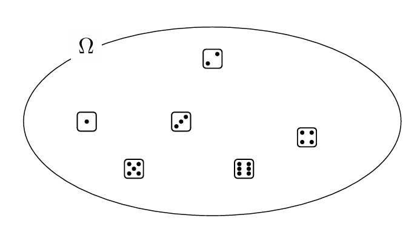

# Probability

Created: 2024年11月24日 20:45
Class: COMS10014

# Finite Probability Spaces

## 定义

- **样本空间（Ω）**所有可能结果的集合  A finite set Ω called a the sample space
- **分布函数（p）**一个从样本空间到 [0, 1] 的函数，表示每个结果发生的概率，且所有概率的和为1
    
    A function p : Ω → [0,1] called the distribution, satisfying $1 = \sum_{\omega \in \Omega} p(\omega)$
    

<aside>
💡

 $p(ω) ≥ 0$ and   $p(ω) ≤ 1$

</aside>

## 示例

投掷一个D6  $Ω=\{1,2,3,4,5,6\}$  $p(ω) = \frac 16$ for all $ω ∈ Ω$

# Uniform distribution

## 定义

The uniform distribution on a finite set $Ω$ is the function $p : Ω → [0,1]$ that has

 $∀ω : Ω. p(ω) = \frac {1}{|Ω|}$

每个元素具有相同概率的分布称为均匀分布

## 示例

投掷一枚D6的示意图如右图

投掷一枚D6为uniform distribution

如果一个袋子里有3个蓝球和和一个红球如果只关心球的颜色的话

$Ω = \{blue,red\}$

 $p(blue) = 3/4$ 

 $p(red) = 1/4$

这是不是均匀分布

# Events

事件是样本空间的一个子集，代表一组可能的结果。计算一个事件的概率就是将该事件中所有结果的概率相加

 For $p : Ω →[0,1]$ we can define $P : P(Ω) → [0,1]$ as $P(S) = \sum _{s∈S}p(s)$. Then:

$P(∅) =0\quad and\quad P(Ω) =1$

$\text {If}\quad S ⊆ T \quad then\quad P(S) ≤ P(T)$

$P(\overline S) = 1−P(S)$, taking $Ω$ as the universe

$P(S ∪T)≤P(S)+P(T)$ and $P(S ∩T)≤min(P(S),P(T))$

More generally, $P(S ∪T) = P(S)+P(T)−P(S ∩T)$

If $S$,$T$ are disjoint subsets, then $P(S ∪T) = P(S)+P(T)$

## **Examples**

1. What is the probability of drawing a court card?
- **样本空间**：整副牌的集合，共52张。
- **事件**：抽取一张宫廷牌。
- **计算概率**：宫廷牌共12张，因此概率为$\frac{12}{56} \approx 0.23$
1. 连续两次抽取数字牌的概率
- **第一次抽牌**：抽到数字牌（2到10）的概率为 $\frac{40}{52}$
- **第二次抽牌**：再次抽牌，抽到数字牌的概率仍为$\frac{40}{52}$
- **总概率**：两次都抽到数字牌的概率为$(\frac{40}{52})^2 \approx 0.592$
1. 不放回连续抽两张数字牌的概率
- **第一次抽牌**：数字牌的概率仍为$\frac{40}{52}$
- **第二次抽牌**：因为第一张已经抽走了一张数字牌，所以剩下的牌中数字牌的数量减少到39，剩余的牌总数为51，因此概率为$\frac{39}{51}$
- **总概率**：两次都抽到数字牌的概率为$\frac{40}{52} \times \frac{39}{51} \approx 0.588$

# Drawing with and without Replacement

当你从一组对象中抽取时，可以选择有放回抽取（每次抽取后都将对象放回原处）或无放回抽取（抽取后不再放回）这两种方法对概率计算有重要影响

### 有放回抽取

在有放回抽取的情况下，每次抽取都是独立的，因为每次抽取后样本空间和概率分布不会改变。例如，如果从一副52张的牌中有放回地连续抽取两张牌，每次抽到特定牌的概率始终不变。

### 无放回抽取

在无放回抽取的情况下，每次抽取会改变剩余对象的总数和分布，从而影响后续的抽取概率。例如，从52张牌中无放回抽取两张牌，第一次抽取后牌的总数变为51张，影响了第二次抽取的概率。

如果有 n 个对象，并且其中 m 个具有某种属性，那么在无放回抽取 k 次的情况下，所有抽取都具有该属性的概率为

$$
\frac{m \times (m-1) \times \cdots \times (m-k+1)}{n \times (n-1) \times \cdots \times (n-k+1)}
$$

## Independence

In a sample space $Ω$, two events $A$,$B$ are called independent if $P(A∩B) = P(A)×P(B)$

当两个事件的交集的概率等于各自概率的乘积时，这意味着一个事件的发生不会影响另一个事件的发生概率。也就是说，这两个事件在概率意义上是彼此独立的

### 示例

**掷骰子**：如果你连续掷两次骰子，第一次掷骰子得到的结果并不会影响第二次掷骰子的结果。因此，第一次掷得6点和第二次掷得6点这两个事件是独立的
**抽牌**：如果你从一副牌中抽取一张牌，记录结果后放回，并再次洗牌抽牌，那么两次抽到相同牌的事件也是独立的，因为第一次的结果通过放回和洗牌已经不影响第二次的结果了

# Adding Results of Experiments

$mdn$ 表示投掷  $m$ 个 $n$  面的骰子，并将结果相加

当多个独立实验的结果被叠加时，虽然每个单独实验的结果可能遵循均匀分布，但结果的总和并不遵循均匀分布。例如，当你投掷两个六面骰子并将结果相加时，某些结果的出现概率高于其他结果。这是因为有些数字组合的方式比其他数字更多。

## 示例

考虑两个骰子，一个白色一个黑色，以便区分。当两个骰子的结果相加时，可以得到的总和为2到12。但每个总和出现的概率不同

我们可以得到样本空间$\Omega =\{2,...,12\}$

$$
\begin{array}{|c|c|c|c|c|c|c|c|c|c|c|c|c|}
\hline
\omega & 2 & 3 & 4 & 5 & 6 & 7 & 8 & 9 & 10 & 11 & 12 \\
\hline
p(\omega) & \frac{1}{36} & \frac{2}{36} & \frac{3}{36} & \frac{4}{36} & \frac{5}{36} & \frac{6}{36} & \frac{5}{36} & \frac{4}{36} & \frac{3}{36} & \frac{2}{36} & \frac{1}{36} \\
\hline
\end{array}
$$

这种分布形成了一个概率密度中间高两端低的“驼峰”形状，这在统计学中被称为正态分布的前身

# The Binomial Distribution

## 定义

如果在一次试验中成功的概率是$p$，进行$n$ 次独立的试验，那么恰好获得$m$ 次成功的概率由二项分布给出

$$
\text{BINOM}_{n,p}(m) = \binom{n}{m} p^m (1-p)^{n-m}
$$

- **成功的概率 $p$**：在每次独立试验中，事件成功的概率。
- **试验次数 $n$**：进行的总试验次数。
- **成功次数 $m$**：关注的成功次数。

## 示例

假设一家公司进行市场调查，想知道他们的新产品是否受欢迎。调查问卷显示有60%的受访者喜欢这个新产品。如果随机选择10名受访者，我们可以使用二项分布来计算恰好有6人喜欢这个新产品的概率

$$
P(X = 6) = \binom{10}{6}(0.6)^6(0.4)^4 \approx 0.2508
$$

# Discrete Probability

## 定义

离散概率空间是指样本空间$\Omega$ 是有限的或者可数无限的，其中每个基本事件都有一个非负的概率分配，且所有这些概率的总和为1

## 离散概率的关键特性：

1. **概率和为一**：对于所有可能的基本事件 $\omega$ 的概率之和必须等于1，即：
    
    $\sum_{\omega \in \Omega} p(\omega) = 1$
    
2. **可数加性**：在离散概率理论中，如果有一组互斥事件（即它们不能同时发生），则这组事件发生的概率等于各自发生概率的和。

### 离散概率空间的例子：

- **掷骰子**：一个六面骰子的所有结果形成一个有限的离散概率空间，每个面朝上的概率是1/6。
- **投硬币**：投掷一枚硬币的结果（正面或反面）也形成了一个有限的离散概率空间，每个结果的概率是1/2。
