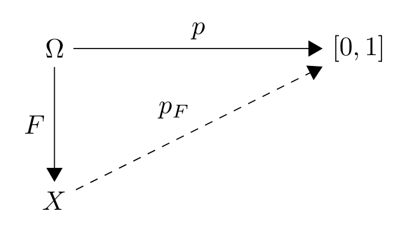

# Random Variables

Created: 2024年11月25日 11:06
Class: COMS10014

# Random variables

## 定义

在概率空间上的一个函数，其将实验的每个可能结果（样本点）映射到一些实数或其他类型的标签上

$\Omega$是一个概率空间，其中$p:\Omega\rightarrow[0,1]$ 一个在$\Omega$上的随机变量是一个函数$F:\Omega\rightarrow X$(X可以是任何的集合)

这产生了一个新的分布 $p_x:X\rightarrow[0,1]$定义为

$$
p_F(x) = P(\{\omega \in \Omega \mid F(\omega) = x\}) = \sum_{\omega \in F^*(x)} p(\omega)
$$

## 示例 1

考虑掷两个六面骰子的实验 probability space $Ω=\{1,2,3,4,5,6\} × \{1,2,3,4,5,6\}$

，随机变量$F(a,b)=a+b$表示两个骰子点数之和

例如$p_F(8)$是掷出和为 8 的概率，根据掷骰子的结果来计算  $(2, 6), (3,5),(4,4),(5,3),(6,2)$

So, $p_F(8) = \frac{5}{36}$

## 示例 2

考虑投掷一枚D6 投中1或者2你会失去一枚硬币，投中6你会得到2枚硬币，对于另外的情况什么也不会发生

$Ω = \{1,2,3,4,5,6\}$

$F(1) = F(2) = (−1)\\ F(3) = F(4) = F(5) = 0\\$ $F(6) = 2$

 $p_F(0) = \frac36 = \frac12$ 因为有三种投掷出0的情况

$p_F(1)=?$

$p_F(2)=\frac 16$

# The random variable diagram

这个图解解释了随机变量如何将一个概率从一个空间转移到另一个空

原始的概率空间$(\Omega,p)$通过随机变量$F$转换为了新的概率空间$(X,p_F)$

## 示例

考虑一个包含3个蓝球和1个红球的罐子。根据经典的概率解释，我们给每个球一个身份，并认为每个球被选中的可能性是相等的。对于“抽到蓝球的概率是多少？”这个问题，我们可以通过以下步骤转换空间

1. 样本空间$\Omega = \{B1, B2, B3, R\}$其中 $B1, B2, B3$ 代表三个蓝球，$R$ 代表一个红球
2. 概率分布$p(\omega) = 1/4$ 对所有$\omega$都成立，因为每个球被选中的概率是相等的
3. 随机变量$F(\omega)$的定义如下
    
    $F(B1) = F(B2) = F(B3) = \text{blue}$
    
    $F(R) = \text{red}$
    
    换句话说，随机变量 F 将一个球的身份映射为它的颜色，从而忽略了它的具体身份
    
4. 新的概率分布$p_F$
    
    $p_F(\text{blue}) = \sum_{\{\omega \in \Omega | F(\omega) = \text{blue}\}} p(\omega) = p(B1) + p(B2) + p(B3) = 3/4$
    
    $p_F(\text{red}) = \sum_{\{\omega \in \Omega | F(\omega) = \text{red}\}} p(\omega) = p(R) = 1/4$
    

随机变量 F 将一个球的身份映射为它的颜色，从而忽略了它的具体身份

这种方法在很多情况下都适用，例如，当你“投掷一个骰子并只关注结果是否为偶数”时，或者“抽一张牌并只关注它的花色、点数或颜色”时。通常的做法是：

- 从一个均匀分布的基础概率空间（例如所有牌、所有球或所有骰子面）开始。
- 计算一个随机变量的概率分布，它投影到你感兴趣的属性上。

# Indicator variables

## 定义

指示变量是定义在样本空间上的随机变量，对于一个给定的事件$E$和样本点$\omega$指示变量$χE(ω)$

如果 $\omega \in E$（即样本点属于事件 $E$），则 $\chi_E(\omega) = 1$

如果 $\omega \notin E$（即样本点不属于事件 $E$），则 $\chi_E(\omega) = 0$

<aside>
💡

χ读作chi

</aside>

## 示例

考虑一个掷骰子的实验，定义事件$E$为掷出的点数大于4（即结果为5或6）。对应的指示变量$\chi_E$ 将如下工作

$\chi_E(\omega) = 1$，如果骰子结果 $\omega$ 是 5 或 6（满足事件 $E$）

$\chi_E(\omega) = 0$，如果骰子结果 $\omega$ 是 1、2、3 或 4（不满足事件 $E$）、

### 1. 计算指示变量的期望值 $E[\chi_E]$

因为只有当结果是5或6时，$\chi_E$才等于1，而这两种结果的概率之和即为 $\chi_E = 1$ 的概率

结果为5或6的概率分别是 $\frac{1}{6}$ 和 $\frac{1}{6}$，所以

$P(E) = P(\omega = 5 \text{ or } \omega = 6) = \frac{1}{6} + \frac{1}{6} = \frac{2}{6} = \frac{1}{3}$

### 2. 指示变量$\chi_E$的期望值

$E[\chi_E]$ 等于 $\chi_E = 1$ 的概率，这是因为期望值就是所有可能结果的概率加权和。而 $\chi_E$ 只在5和6时为1，其他时为0：

$E[\chi_E] = 1 \times P(\chi_E = 1) + 0 \times P(\chi_E = 0) = 1 \times \frac{1}{3} + 0 \times \frac{2}{3} = \frac{1}{3}$

$$
P(E) = p_{χE}
 (1)
$$

# Joint probabilities

## 定义

联合概率分布描述了在同一个概率空间中，多个随机变量同时取特定值的概率。如果 A 和 B 是两个随机变量，那么联合概率$p_{A,B}(a, b)$表示随机变量A 取值a 且随机变量B 取值b 的概率

联合概率可以通过以下公式定义 对于随机变量$A:\Omega \rightarrow \mathcal A$ and $B:\Omega \rightarrow \mathcal B$ 

$$
p_{A,B}(a,b) = P(\{\omega \in \Omega \mid A(\omega) = a \land B(\omega) = b\})
$$

$\mathcal A \times\mathcal B\rightarrow[0,1]$

如果随机变量是指示变量那么联合概率$p_{\chi_A, \chi_B}(1, 1)$是$P(A \cap B)$ 是他们事件相交的概率

# Independence

如果两个随机变量 A 和 B 是独立的，那么对于所有可能的 a 和 b 的值，随机变量 A 取值 a 和随机变量 B 取值 b 的联合概率等于它们各自概率的乘积，即

$$
\forall a \in \mathcal{A}, \forall b \in \mathcal{B}, \, p_{A,B}(a,b) = p_A(a) \times p_B(b)
$$

独立性的概念告诉我们，如果两个随机变量是独立的，那么知道一个变量的结果不会提供关于另一个变量结果的任何信息。这是因为两个变量的结果没有相互影响

## 示例 1

假设你有两个六面骰子，一个红色，一个蓝色，每个骰子的结果都是独立的。这意味着红色骰子的任何一个特定结果与蓝色骰子的任何一个特定结果都是独立的。例如，红色骰子出现1的概率和蓝色骰子出现6的概率相乘就是两者同时发生的概率$p_{A,B}(1,6) = p_A(1) \times p_B(6) = \frac{1}{6} \times \frac{1}{6} = \frac{1}{36}$

## 示例 2

设想你掷一个六面骰子，定义两个随机变量

A 是一个指示变量，如果骰子的值为4或更高（即4, 5, 6）则 A = 1； 否则 A = 0

B 也是一个指示变量，如果骰子的值是偶数（即2, 4, 6），则 B = 1； 否则 B = 0

每个事件都覆盖了D6的所有可能结果我们有 $p_A(0)=p_A(1)=\frac12$       $p_B(0)=p_B(1)=\frac12$

但是$p_{A,B}(1,1)$是同时得到一个既是偶数又大于3的数的概率，这里只有两种情况满足（即4和6），因此$p_{A,B}(1,1) = \frac 26 = \frac13$ 这个概率不等于$p_A(1)\times p_B(1)=\frac12 \times \frac 12$所以A和B不是独立的

如果你知道事件A 发生了（骰子的值为4或更高），这会增加事件B（骰子的值为偶数）发生的概率

# Alternative notation

使用条件概率符号 P 来表示随机变量的概率。这种记号强调了事件和随机变量之间的关系，并使得公式看起来更像逻辑表达式

$P(A = a)$: 表示随机变量 $A$ 取特定值 $a$ 的概率。这是表示形式 $p_A(a)$ 的替代方式，它强调了这是在计算事件 $\{\omega \in \Omega | A(\omega) = a\}$ 的概率。

$P(A = a \land B = b)$ 或 $P(A = a \cap B = b)$: 表示随机变量 $A$ 和 $B$ 同时取特定值 $a$ 和 $b$ 的概率，相当于联合概率 $p_{A,B}(a,b)$。

$P(A = a \lor B = b)$: 表示随机变量 $A$ 或 $B$ 至少有一个取特定值的概率，用于表示至少一个条件满足的情形。

## 示例

假设我们掷两个六面骰子，并定义 F 为这两个骰子的点数之和的随机变量。那么，计算 F 等于5的概率，可以用 $P(S=5)$ 表示，这是一个使用替代记号的例子。在这种情况下

骰子和为5的具体组合有 $(1,4), (2,3), (3,2), (4,1)$，每种组合出现的概率都是 $\frac{1}{36}$（因为每个骰子的每一面出现的概率是 $\frac{1}{6}$，而两个独立事件同时发生的概率是各自概率的乘积）。

因此，$P(S = 5)$ 的计算将包括这四种情况的概率之和：$P(S = 5) = \frac{1}{36} + \frac{1}{36} + \frac{1}{36} + \frac{1}{36} = \frac{4}{36} = \frac{1}{9}.$
