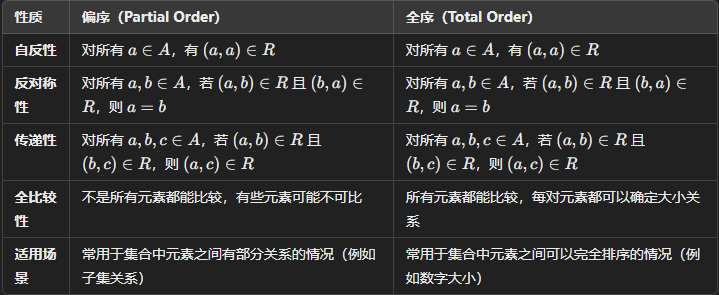

# Relations

Created: 2024年11月24日 16:10
Class: COMS10014

# Definition of Relations

## 定义

关系 $R$ 在集合 $A$ 和 $B$ 之间定义为$A×B$的一个子集。对于元素$a ∈ A$和$b ∈ B$，我们可以写作$R(a, b)$或$a\,R\,b$来表示$(a, b) ∈ R$（元素a和b相互关联），并写作$¬R(a, b)$或$a \not\mathrel{R} b$来表示$(a, b) \notin R$（元素a和b不相互关联）

## 案例

假设有两个集合：

- **A** 是学生的集合，包含 {Alice, Bob, Carol}。
- **B** 是课程的集合，包含 {Mathematics, History, Science}。

我们可以定义一个关系 **R**，表示“学生注册了课程”。这个关系 **R** 可能包括如下有序对：

- (Alice, Mathematics)
- (Alice, History)
- (Bob, Science)
- (Carol, Mathematics)
- (Carol, History)

这里，**R(Alice, Mathematics)** 表示 Alice 注册了 Mathematics 课程

如果我们说 **¬R(Alice, Science)**，那意味着 Alice 没有注册 Science 课程

# Inverse of Relations

## 定义

（为什么没有中文🥲让我们说中文好吗好的）

The inverse $R^{(−1)}$ of a relation $R ⊆ A × B$ is the relation $\{(b,a) | (a,b) ∈ R\}$. 

This is a subset of $B ×A$

For example, the inverse of the relation ‘**student a takes class b**’ is the relation 

‘**class b is taken by student a**’.

(耶！) 如果关系 $R⊆A×B$，它的**逆关系** $R^{(-1)}$是：

$R^{(−1)}$ $=$ { ${(b,a)∣(a,b)∈R}$ }

- **含义**：逆关系交换了 R 中每个元素的顺序。
- $R^{(-1)}$是 $B×A$  的一个子集。
- 假设关系R表示“学生a选了课程b”（即$(a,b)∈R)$）
- 那么逆关系 $\R^{(-1)}$ 表示“课程b被学生a选了”（$(b,a)∈R^{(−1)}$）.

# Composition of Relations

## 定义

设有两个关系，$R ⊆ A × B$ 和 $S ⊆ B × C$。关系$R$的定义域是集合$A$，值域是集合$B$；关系$S$的定义域是集合$B$，值域是集合$C$。那么关系$R$和$S$的组合，记作$R ◦ S$，是定义在$A$和$C$之间的一个新关系$T$，即$T ⊆ A × C$。对于所有的$a ∈ A$和$c ∈ C$，$(a, c) ∈ T$当且仅当存在至少一个元素$b ∈ B$使得$(a, b) ∈ R$且$(b, c) ∈ S$

$$
⁍
$$

这意味着，如果存在一个中间元素$b$，使得$a$通过关系$R$与$b$相关联，且$b$通过关系$S$与$c$相关联，那么在组合关系$R ◦ S$中，$a$与$c$直接相关联

# Partial and Total Orders

## Partial order

偏序是在单个集合 $A$ 上定义的一种关系 $R$，A relation$R⊆A\times A$ is called **partial order** 并且这种关系满足以下三个性质
在偏序集合中，**不是所有的元素都能被比较**，也就是说，在某些情况下我们不能说“一个元素比另一个元素大”或者“一个元素比另一个元素小”。但是，当元素能被比较时，必须满足以下条件

- **自反性（Reflexive）:** 对所有的$a ∈ A$，有$(a, a) ∈ R$。
- **反对称性（Antisymmetric）:** 对所有的$a, b ∈ A$，如果$(a, b) ∈ R$且$a ≠ b$，则$(b, a) \notin R$。
- **传递性（Transitive）:** 对所有的$a, b, c ∈ A$，如果$(a, b) ∈ R$且$(b, c) ∈ R$，则$(a, c) ∈ R$。

### 示例

**子集关系**：0

- 假设我们有一个集合 $S=\{1,2,3\}$，它的子集包括：$\emptyset, \{1\}, \{2\}, \{3\}, \{1, 2\}, \{1, 3\}, \{2, 3\}, \{1, 2, 3\}$
- **子集关系**就是一个典型的部分序关系，因为不是每一对集合都可以比较。例如：
    - $\{1\} \subseteq \{1, 2\}$（可以比较：{1} 是 {1,2} 的子集）
    - 但是，$\{1\}$ 和$\ \{2\}$ **不能**比较，因为它们没有包含关系，既不是子集也不是超集。
- 因此，**不是每对集合都能比较大小**，所以这是一个部分序。

## Total Orders

在偏序的基础上，如果对所有的$a, b ∈ A（且a ≠ b）$，恰好有$(a, b) ∈ R或(b, a) ∈ R$，那么这种偏序就是全序

### 示例

**数字的大小关系（实数、整数、自然数等）**：

- 对于集合 $R$（所有实数），我们可以比较任意两个实数 $a$ 和 $b$，并且知道哪个大哪个小：
    - $3.5 \leq 4$
    - $2 \leq 0$
    - $5 \leq 5$
- 所有实数之间都可以比较大小，因此这就是一个 **全序**
- 区别
    
    
    

# Orders and Cartesian Products

考虑A = {1, 2}和B = {3, 4}，它们的笛卡尔积A×B就是：

- $A×B = \{(1, 3), (1, 4), (2, 3), (2, 4)\}$

我们可以尝试通过以下方式在这个产品集合上定义一个偏序：

- $T = \{((a, b), (a′, b′)) | a ≤ a′ ∧ b ≤ b′\}$
这意味着一对$(a, b)$与另一对$(a′, b′)$之间存在偏序关系，如果并且仅如果$a ≤ a′$和$b ≤ b′$

这种定义确实形成了一个偏序，因为它满足自反性、反对称性和传递性。然而，即使原来的两个偏序都是全序，这个由它们导出的偏序却可能不是全序。这是因为在这个偏序中，某些元素对可能是不可比较的

例如，考虑元素对(1, 4)和(2, 3)：

- 我们无法说$(1, 4) ≤ (2, 3)$，因为虽然$1 ≤ 2$，但$4 > 3$。
- 我们也无法说$(2, 3) ≤ (1, 4)$，因为虽然$3 ≤ 4$，但$2 > 1$。

可以通过另一种方式定义偏序，以保持全序的属性，称为词典序（Lexicographic order）

$$
T = \{((a, b), (a′, b′)) | [(a, a′) ∈ R ∧ a ≠ a′] ∨ [a = a′ ∧ (b, b′) ∈ S]\}
$$

这个定义说，一对$(a, b)$小于或等于另一对$(a′, b′)$，如果$a < a′$，或者在$a = a′$的情况下，$b ≤ b′$。这种方式可以有效地将偏序扩展到笛卡尔积上，并且在保持原有偏序的完全性的同时，也保持了元素对之间的可比较性

- 比较(1, 3)和(2, 3)：由于1 < 2，根据词典序，(1, 3) < (2, 3)。
- 比较(1, 4)和(1, 3)：尽管一般的偏序如前所述可能无法比较这两个元素对，但在词典序中，由于第一个元素相同，我们比较第二个元素。因为4 > 3，所以(1, 4) > (1, 3)。
- 比较(2, 3)和(2, 4)：第一个元素2相同，比较第二个元素，3 < 4，因此(2, 3) < (2, 4)。

# Equivalence Relations

## 定义

等价关系$R ⊆ A × A$ 是在集合A上定义的一种关系R，它满足以下三个性质

- **自反性（Reflexive）:** 对所有的a ∈ A，有(a, a) ∈ R。
- **对称性（Symmetric）:** 对所有的a, b ∈ A，如果(a, b) ∈ R，则(b, a) ∈ R。
- **传递性（Transitive）:** 对所有的a, b, c ∈ A，如果(a, b) ∈ R且(b, c) ∈ R，则(a, c) ∈ R。

这三个性质共同保证了等价关系可以将集合A分割成若干互不相交的子集，每个子集中的元素相互“等价”

## 示例

假设集合A包含元素 $A = \{(\text{red}, \bigcirc), (\text{blue}, \bigcirc), (\text{red}, \triangle), (\text{blue}, \triangle), (\text{red}, \square), (\text{blue}, \square)\}$。我们可以定义一个等价关系R，其中两个元素等价如果它们有相同的形状

等价关系$R$表示的是元素之间的“等价”关系，这里定义为形状相同的元素是等价的。

$$
R = \{
((\text{red}, \bigcirc), (\text{red}, \bigcirc)), \, ((\text{red}, \bigcirc), (\text{blue}, \bigcirc)), \\
((\text{blue}, \bigcirc), (\text{red}, \bigcirc)), \, ((\text{blue}, \bigcirc), (\text{blue}, \bigcirc)), \\
((\text{red}, \triangle), (\text{red}, \triangle)), \, ((\text{red}, \triangle), (\text{blue}, \triangle)), \\
((\text{blue}, \triangle), (\text{red}, \triangle)), \, ((\text{blue}, \triangle), (\text{blue}, \triangle)), \\
((\text{red}, \square), (\text{red}, \square)), \, ((\text{red}, \square), (\text{blue}, \square)), \\
((\text{blue}, \square), (\text{red}, \square)), \, ((\text{blue}, \square), (\text{blue}, \square)) \\
\}
$$

# Number Theory Example

欧几里得算法

$$
a = qb + r, \quad r \in \{0, 1, \ldots, b - 1\}
$$

例如b=5, r的所有结果是$\{0,1,2,3,4\}$我们可以定义一个等价关系，称为模b的同余关系。两个整数u和v被视为在模b同余的情况下等价，如果它们除以b的余数相同

$u \sim_5 v \leftrightarrow r_5(u) = r_5(v)$

也可以写成$u \equiv v \pmod{5}$ 或者$u \equiv_5 v$

$$
\begin{aligned}
\text{remainder 0} & \quad \{ \ldots, -10, -5, 0, 5, 10, \ldots \} & = \{5k \mid k \in \mathbb{Z}\} \\
\text{remainder 1} & \quad \{ \ldots, -9, -4, 1, 6, 11, \ldots \} & = \{5k + 1 \mid k \in \mathbb{Z}\} \\
\text{remainder 2} & \quad \{ \ldots, -8, -3, 2, 7, 12, \ldots \} & = \{5k + 2 \mid k \in \mathbb{Z}\} \\
\text{remainder 3} & \quad \{ \ldots, -7, -2, 3, 8, 13, \ldots \} & = \{5k + 3 \mid k \in \mathbb{Z}\} \\
\text{remainder 4} & \quad \{ \ldots, -6, -1, 4, 9, 14, \ldots \} & = \{5k + 4 \mid k \in \mathbb{Z}\}
\end{aligned}
$$

# 详细解释reflexive, symmetric, and transitive

### 1. 自反性（Reflexive）

**定义：**

在一个集合 $A$ 上的二元关系 $R$ 被称为**自反的**，如果对于集合 $A$ 中的每一个元素 $a$，都存在关系 $R(a, a) \in R$。即，每个元素都与自身相关联。

**数学表达：**$\forall a \in A, \ (a, a) \in R$

**性质：**

- **等于关系：** 在集合  $\mathbb{R}$ 上的等于关系  $=$ 是自反的，因为对于任意实数 $a$ ，都有 。
    
    $$
    a = a
    $$
    
- **小于关系：** 在集合  $\mathbb{R}$ 上的“小于”关系 $<$ 不是自反的，因为对于任何实数 $a$ ， $a < a$ 不成立。

**如何判断：**

要判断一个关系 $\R$ 是否自反，只需检查集合中每个元素是否与自身有该关系。若存在至少一个元素 $a$ 使得 $(a, a) \notin R$，则 R 不是自反的。

### 2. 对称性（Symmetric）

**定义：**

在一个集合 $A$ 上的二元关系 $R$ 被称为**对称的**，如果对于集合 $A$ 中的任意两个元素 $a$ 和 $b$，只要 $a$ 与 $b$  有关系 $R$（即 $(a, b) \in R$），那么 b 也与 $a$ 有关系 $R$（即 $(b, a) \in R$）。

**数学表达：**$\forall a, b \in A, \ (a, b) \in R \Rightarrow (b, a) \in R$

**示例：**

- **等于关系：** 在集合  $\mathbb{R}$ 上的等于关系  $=$ 是对称的，因为如果 $a=b$ ，那么  $b=a$ 成立。
- **“小于”关系：** 在集合 $\mathbb{R}$ 上的“小于”关系 $<$ 不是对称的，因为如果  $a<b$，通常 $b \nless a$。

**如何判断：**

要判断一个关系 $R$ 是否对称，只需检查对于每一对 $(a, b) \in R$，是否同时存在 $(b, a) \in R$。如果存在至少一对 $(a, b)$  使得 $(b, a) \notin R$，则 $R$ 不是对称的。

### 3. 传递性（Transitive）

**定义：**

在一个集合 $A$ 上的二元关系 $R$ 被称为**传递的**，如果对于集合 $A$  中的任意三个元素  $a、b$ 和 $c$，只要 $a$ 与 $b$ 有关系 $R$ 且 $b$ 与 
$$$c$ 有关系 $R$，那么 
$$$a$ 与 $c$ 也必须有关系 $R$。

**数学表达：**$\forall a, b, c \in A, \ [(a, b) \in R \ \text{且} \ (b, c) \in R] \Rightarrow (a, c) \in R$

**示例：**

- **等于关系：** 在集合  $\mathbb{R}$ 上的等于关系 $=$ 是传递的，因为如果 $a=b$ 且 $b = c$ ，那么$a = c$ 。
- **“小于或等于”关系：** 在集合 $\mathbb{R}$ 上的“小于或等于”关系 $\leq$ 是传递的，因为如果 $a \leq b$ 且 $b \leq c$，那么$a \leq c$ 。
- **邻接关系：** 在图论中，如果关系表示“两个节点相邻”，则通常不具有传递性，因为 $a$ 邻接 
$b$，且  $b$ 邻接 $c$ 不一定意味着 $a$ 邻接 $c$。
    
    e.g.
    
    $A → B → C$
    

**如何判断：**

要判断一个关系 $R$  是否传递，只需检查对于所有可能的三元组 $(a, b, c)$，如果 $(a, b) \in R$ 且 $(b, c) \in R$，则必须有 $(a, c) \in R$。如果存在至少一组三元组不满足这一条件，则 $R$ 不是传递的。

### 综合判断

一个关系可以同时具有以上三种性质，也可能仅具有其中的一部分。例如，等于关系 $=$ 在任何集合上都是自反的、对称的和传递的，因此它是一种等价关系（equivalence relation）。在实际应用中，理解和判断这些性质对于构建数学模型、证明定理和解决问题都是非常重要的。

**示例综合判断：**

考虑集合 $A = \{1, 2, 3\}$ 和关系 $R = \{(1,1), (2,2), (3,3), (1,2), (2,1)\}$。

- **自反性**Reflexive**：** 检查$(1,1)$ 、$(2,2)$、 $(3,3)$都在  $R$ 中，满足自反性。
- **对称性**Symmetric**：** 对于 $(1,2) \in R$ ，对应的 $(2,1) \in R$ 也在  中；其他对称对也满足，因此 $R$ 是对称的。
- **传递性**Transitive**：** 检查所有可能的三元组：
    - $(1,1)$和 $(1,2)$ 应该包含$(1,2)$ ，已在 $R$ 中。
    - $(1,2)$ 和   $(2,1)$ 应该包含 $(1,1)$ ，已在 $R$ 中。
    - $(2,1)$ 和 $(1,2)$ 应该包含 $(2,2)$，已在 R 中。
    - 其他组合也满足传递性。

因此，关系 $R$ 在集合 $A$ 上是自反的、对称的且传递的。

### 总结

- **自反性**Reflexive要求每个元素与自身有关系。
- **对称性**Symmetric要求如果一个元素与另一个元素有关系，那么反过来也必须有。
- **传递性**Transitive要求如果一个元素与第二个元素有关系，且第二个元素与第三个元素有关系，那么第一个元素也必须与第三个元素有关系。

通过逐一检查这些条件，可以判断一个给定的二元关系是否具备自反性、对称性和传递性。

- 示例 1
    
    **集合 $A = \{1, 2, 3\}$**
    
    **关系**$R = \{(1,1), (2,2), (3,3)\}$
    
    对于集合中的每个元素 $a \in A$，都有$(a, a) \in R$，即 $(1,1)、(2,2)、(3,3)$ 都在 $R$ 中。
    
    - **结论**：**自反**Reflexive。
    
    对于关系中的每一对 $(a, b) \in R$，如果 $(a, b) \in R$，则 $(b,a)$ 也在 $R$ 中。由于关系中只有元素与自身的关系，显然满足对称性。
    
    - **结论**：**对称Symmetric**
    
    对于所有的三元组 $(a, b) \in R$  和 $(b, c) \in R$，要检查是否有 $(a, c) \in R$。由于只有 $(a,a)$ 类型的元素，传递性显然成立。
    
    - **结论**：**传递**Transitive。
- 示例 2
    
    **集合**: $A={1,2,3}$
    
    **关系**: $R = \{(1, 1), (1, 2), (1, 3), (2, 2), (2, 3), (3, 3)\}$
    
    ### 自反性：
    
    对于集合中的每个元素 $a \in A$，都有 $(a, a) \in R$。
    
    - **结论**：**自反**。
    
    ### 对称性：
    
    检查关系中的每一对 $(a,b)$ 是否有对应的 $(b,a)$。例如，$(1, 2) \in R$，但 $(2, 1) \notin R$，因此关系不满足对称性。
    
    - **结论**：**不对称**。
    
    ### 传递性：
    
    检查是否对于任意的 $(a, b) \in R$ 和 $(b, c) \in R$，有 $(a, c) \in R$：
    
    - $(1, 2) \in R$ 和 $(2,3)∈R$，根据传递性，应该有 $(1,3)∈R$，这个条件成立。
    - $(2, 2) \in R$ 和 $(2,3)∈R$，应该有 $(2,3)∈R$，这个条件也成立。
    - 其他组合也满足传递性。
    - **结论**：**传递**。
    
    所以，关系 $R$ 是**自反的**和**传递的**，但**不对称**。
