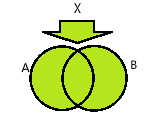

# Sets

Created: 2024年11月23日 22:51
Class: COMS10014

# Why Sets?

集合的核心作用是处理“一种或多种答案”的问题

- 有些方程只有一个解，例如 $2x−1=5$的解是 $x=3$。
- 有些方程有多个解，例如 $(x−1)(x−2)=0$，解是 $x=1$ 和 $x=2$。
- 有些方程没有解，例如 $x+1=x$。
- 还有些方程有无限多个解，例如 $x=x$。
这种情况下，单个值或列表都无法完美表达这些结果。而**集合**可以很好地解决这个问题，因为它是元素的无序集合，可以清楚表达“是否包含某个元素”

# Sets and Elements

集合和元素

## 定义

- 如果 $x$ 是一个元素，$S$ 是一个集合，表示 $x∈S$ 意味着 $x$ 是 $S$ 的元素；否则 $x\notin S$。
- 比如，$S=\{2,3\}$，那么 $2∈S$ 而 $4 \notin S$

## 集合的特性：

1. 集合中没有重复元素。
2. 集合本身也可以成为另一个集合的元素。例如，集合 $\{\{1\},2\}$ 中包含集合 $\{1\}$ 和元素 $2$。

有一些集合有他们自己的名字比如说

$$
自然数集合 ⁍
$$

$$
整数集合⁍
$$

$$
实数集合⁍
$$

## Set equality

**Two sets are equal if and only if they contain the same elements**

$$
 ∀X,Y : sets . (X = Y ↔∀a:element.(a ∈ X ↔a∈Y))
$$

## Empty set

**空集合** $(\emptyset)$ 是没有任何元素的集合 We write it either $\{\}$ or $∅$

$$
∀a . a \notin ∅
$$

# Set Restriction and Subsets

## Set restriction

## 定义

集合约束是指从一个已知的集合中，筛选出满足某个条件（谓词）的元素，形成一个新的子集

$$
\{x∈S ∣ P(x)\}
$$

在集合 $S$ 中，满足条件 $P(x)$ 的所有 $x$ 的集合

这表示“从集合 $S$ 中挑选出所有满足条件 $P(x)$ 的元素组成的集合”。

这个新的集合被称为**集合的约束**

### **示例 1**：

- 设 $S=\{1,2,3,4,5\}$，条件 $P(x)$ 是“$x$ 是偶数”。
    - Set restriction 集合约束为：
    $\{x \in S \ | \ x \text{ 是偶数}\} = \{2, 4\}$

## Subset

### 定义

如果集合 $X$ 的所有元素都是集合 $Y$ 的元素，则 $X$ 是 $Y$ 的子集，记为$X \subseteq Y$

If every element of $X$ is also an element of $Y$ ,

$$
 ∀a . (a ∈ X →a∈Y)
$$

$$
two\;sets\;are\;qual\;(X = Y)\;if\;and\;only\;if\;X ⊆ Y ∧Y ⊆ X
$$

如果集合 $X$ 的所有元素都是集合 $Y$ 的元素，则 $X$ 是 $Y$ 的子集，记为 $X \subseteq Y$。

<aside>
💡

特别地，任何集合是自己的子集

</aside>

<aside>
💡

 The empty set is a subset of all sets!  空集是所有集合的子集！

</aside>

$$
∀S : set . ∅ ⊆ S
$$

Set restriction 集合约束 $\{x\in S|P(x)\}$ 的结果一定是原来集合的子集

# Set Operations

## Set Union and Intersection

- **并集（Union）**：集合 $A∪B$ 包含所有属于 A 或 B 的元素。
$x \in A \cup B \iff x \in A \vee x \in B$
    
    
    
- **交集（Intersection）**：集合 $A∩B$ 包含所有同时属于 A 和 B 的元素。
$x \in A \cap B \iff x \in A \wedge x \in B$
    
    
    
- **差集（Difference）**：集合 $A∖B$ 包含所有属于 A 但不属于 B 的元素。
$x \in A \setminus B \iff x \in A \wedge x \notin B$

<aside>
💡

全集  universe   $\mathcal U$

</aside>

## Laws

### **1. 交换律（Commutative laws）**

**定义：**

- 并集（Union）和交集（Intersection）在顺序上没有影响，即：

$$

⁍
$$

$$
⁍
$$

### **2. 结合律（Associative laws）**

**定义：**

- 并集和交集可以按任意顺序分组：

$$

⁍
$$

$$
⁍
$$

### **3. 德摩根律（DeMorgan’s laws）**

**定义：**

- 对集合的补集操作满足以下规则：

$$

⁍
$$

### **4. 分配律（Distributive laws）**

**定义：**

- 交集和并集的分配关系如下：

$$
⁍
$$

$$
⁍
$$

### **5. 幂等律（Idempotent laws）**

**定义：**

- 集合与自身的并集或交集不改变集合：

$$
⁍
$$

$$
⁍
$$

### **6. 排中律（Law of the Excluded Middle）**

**定义：**

- 集合的并集和补集等于全集，交集和补集等于空集：

$$
⁍
$$

$$
⁍
$$

### **7. 消去律（Elimination laws）**

**定义：**

- 集合与空集的并集和交集：

$$
⁍
$$

$$
⁍
$$

$$
⁍
$$

$$
⁍
$$

### **8. 补集律（Complement laws）**

**定义：**

- 全集的补集是空集，空集的补集是全集：

$$
⁍
$$

### **9. 双重补集律（Double Complement Law）**

**定义：**

- 集合的补集的补集是它自己：

$$
⁍
$$

# Venn Diagrams

Venn 图用来直观表示集合关系

# Operations on Multiple Sets

如果$A_1,...,A_n$都是集合的话 $\bigcup_{i=1}^{n} A_i$就是$A_1 \cup \dots \cup A_n$或者更正式的

$$
\forall e. \left( e \in \bigcup_{i=1}^{n} A_i \leftrightarrow e \in A_1 \vee \dots \vee e \in A_n \right)
$$

类似的 或也可以这样$\bigcap_{i=1}^{n} A_i$

### 例如

$A_1 = \{1, 2\}, \, A_2 = \{2, 3\}, \, A_3 = \{3, 4\}$

$$
\bigcup_{i=1}^{3} A_i = \{1, 2, 3, 4\}
$$

当集合的数量不是有限时，比如对一组无限集合执行操作，我们引入 **索引集** 来描述集合。索引集是用来标记多个集合的集合

假设 $I$是索引集，其中每个 $i \in I$ 对应一个集合 $A_i$ ，那么：

$$
\bigcup_{i \in I} A_i = \{ x \mid \exists i \in I, x \in A_i \}
$$

$$
 \bigcap_{i \in I} A_i = \{ x \mid \forall i \in I, x \in A_i \}
$$

## Partition

分区是一种特殊的运算，它将一个集合分割成多个 **互不重叠** 的子集，使得这些子集的并集等于原集合

### 定义

给定一个非空集合$A$ 如果存在一组子集$\{ A_i \}_{i \in I}$满足

并集条件 $A = \bigcup_{i \in I} A_i$

不相交条件 $\forall i, j \in I, \, i \neq j \implies A_i \cap A_j = \emptyset$

那么$\{ A_i \}_{i \in I}$是A的一个分区

### 示例

$A = \{1, 2, 3, 4, 5, 6\}, \, \text{分区为:}$

$A_1 = \{1, 2\}, \, A_2 = \{3, 4\}, \, A_3 = \{5, 6\}$

 $A_1 \cup A_2 \cup A_3 = \{1, 2, 3, 4, 5, 6\}$

 $A_1 \cap A_2 = \emptyset, \, A_1 \cap A_3 = \emptyset, \, A_2 \cap A_3 = \emptyset$

# Sets of Sets

集合可以包含其他集合 例如

$A = \{1\}, \, B = \{1, 2\}, \, C = \{\{1\}, 1, 2\}, \, D = \{\{1\}\}$

集合A 包含一个元素，即整数 1

集合B 包含两个元素，即整数 1 和整数 2

集合C 包含三个元素，其中两个是整数，第三个是一个集合（该集合包含一个整数）。注意，集合$\{1\}$和整数 1 不是同一个东西

集合D 包含一个元素，这个元素本身是一个集合，而这个集合包含一个元素，该元素是一个整数

<aside>
💡

需要区分$\in$（是元素）和$\subseteq$（是子集）

</aside>

$A \in C  表示  A  是  C  的元素$

$A \subseteq C  表示  A  的所有元素也在  C  中$

空集可以是任何集合的元素

我们有以下的集合

**$\{\}$, the empty set, also written $∅$. It contains $0$ elements**

**$\{\{\}\}$, the set containing the empty set. It contains $1$ element, and you could also
write it $\{∅\}$**

**$\{\{\{\}\}\}$, the set containing the set containing the empty set. You could write this
$\{\{∅\}\}$**

# Powersets

一个集合A 的幂集$\mathcal{P}(A)$是所有A 子集的集合 即所有子集的集合

$$
⁍
$$

## 示例

$A = \emptyset \, \text{then} \, \mathcal{P}(A) = \{\emptyset\}$

$A = \{1\} \, \text{then} \, \mathcal{P}(A) = \{\emptyset, \{1\}\}$

$A = \{1, 2\}, \, \text{则} \, \mathcal{P}(A) = \{\emptyset, \{1\}, \{2\}, \{1, 2\}\}$

powerset永远不会是空的，即使最初的set是空的

空集是每一个幂集的元素

幂集总是比原集合大（如果 A 有 n 个元素，幂集有 $2^n$ 个元素）

# Cardinality

基数(集合的模) 集合里元素的数量

$$
⁍
$$

1. 空集的基数是 0
2. 并集的基数不超过单个集合基数的总和
    
    $$
    ⁍
    $$
    
    当且仅当$A \cap B = \emptyset$ 时，等号成立
    
3. 交集的基数小于等于~~单个集合基数的最小值~~（$A$和$B$中较小的集合的大小）
    
    交集的基数满足以下关系
    
    $$
    |A \cap B| \leq \min(|A|, |B|)
    $$
    
4. 并集基数的精确公式
    
    两个集合 A 和B 的并集基数为
    
    $$
    |A \cup B| = |A| + |B| - |A \cap B|
    $$
    
5. 补集的基数
    
    在一个有限的全集 U 中，集合 A 的补集的基数为
    
    $$
    |\overline{A}| = |U| - |A|
    $$
    

# Set Projection

## 定义

$$
\{f(a) \mid a \in A\}
$$

对集合 $A$  中的每个元素 $a$，通过函数 $f$ 生成一个值$f(a)$，并把这些值放入新集合中

这表示对集合 A 中的每个元素 a，通过某个函数 f 映射生成一个新元素 f(a)，并将所有结果组成一个新的集合

### 示例

$$
\{\sqrt{x} \mid x \in \mathbb{N}\} = \{0, 1, \sqrt{2}, \sqrt{3}, 2, \sqrt{5}, \dots\}
$$

# Cartesian Product 笛卡尔积

$两个集合 A 和 B 的笛卡尔积 A \times B  是所有有序对 (a, b) 的集合，其中 a \in A,  b \in B$ 

$\{(a,b) | a ∈ A,b ∈ B\}$

## 例如

$A = \{红色, 蓝色\}, B = \{\bigcirc, \triangle\}$

那么

$A \times B = \{(红色, \bigcirc), (红色, \triangle), (蓝色, \bigcirc), (蓝色, \triangle)\}$
