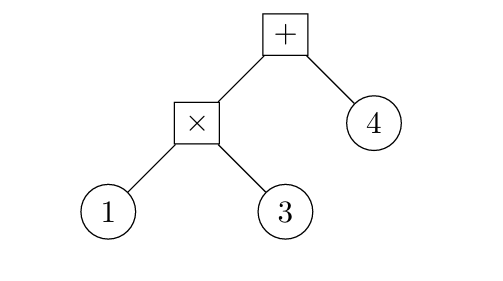

# Term

Created: 2024年11月22日 21:33
Class: COMS10014

# Introduction 定义

"术语 Term"是可以通过一系列规则定义并构建的数学对象

# Syntax of Terms 语法

## 数集

- **自然数 $\N$**：通常是指 $\{0, 1, 2, ...\}$。
- **整数 $\mathbb Z$**：包括所有正整数、负整数和零，即 $\{..., -3, -2, -1, 0, 1, 2, 3, ...\}$。
- **有理数 $\mathbb Q$**：形式为 a/b 的数，其中 a 和 b 是整数，b 不为零。
- **实数 $\R$**：所有实数线上的点，包括无理数和有理数。
- **模 n 整数 $\mathbb {Zn}$**：从 0 到 n-1 的所有自然数，常用于计算机中的固定大小数据类型，如 64 位无符号整数。

<aside>
💡

自然数包括 0

</aside>

## Definition of term

- **一组数字（也称为值）**：
    - 这些是可以直接用作术语的数值。例如，在自然数集中，数字 2 可以直接构成一个值术语。
- **一组变量**：
    - 这些通常是表示未知或可变数量的符号，例如数学和编程中常用的小写字母（如 x, y, z）。
- **一组一元操作**：
    - 这些操作只有一个输入和一个输出。例如，负号操作（negation），它将正数转换为相应的负数，可以将数字 2 转换为 -2。
- **一组二元操作**：
    - 这些操作有两个输入和一个输出。常见的操作包括加（+）、减（-）、乘（×）、除（÷）等。

### 构建术语的规则

- **R1: 对于我们数集中的任何值，我们可以构建一个值术语**。
    - 例如，如果我们有数字 2，我们可以直接构建一个代表这个数的术语。
- **R2: 对于任何变量，我们可以构建一个变量术语**。
    - 例如，如果我们有变量 x，我们可以创建一个代表 x 的术语。
- **R3: 对于任何一元操作和我们已经构建的任何术语 T，我们可以构建一个一元操作术语**。
    - 例如，如果有术语 2 和一元操作负号，我们可以构建一个新的术语 -2。
- **R4: 对于任何二元操作，以及任何两个我们已经构建的术语 T 和 U，我们可以构建一个二元操作术语**。
    - 例如，如果我们有术语 1 和 2x，以及二元操作加号，我们可以构建一个新的术语 1 + 2x。

### 术语的图形表示

例如这个图形表示了术语 (1 * 3) + 4 的结构，其中 “*” 和 “+” 是二元操作，而 1、3 和 4 是值术语

这个图形表示了术语 1 * (3 + 4) 的结构，其中 “*” 和 “+” 是二元操作，而 1、3 和 4 是值术语

# Syntax Rules

## 交换律

- **加法**：如果你有一个包含加法操作的术语，其子术语为 A 和 B，则可以用一个相同操作的新术语替换它，但子术语的顺序相反。也就是说，A + B 可以变成 B + A。
- **乘法**：同样地，A × B 可以变成 B × A。

## 消除律

- 如果你有一个包含减法操作的术语，其两个子术语 A 和 B 是相同的，那么你可以将整个术语替换为值术语 0。也就是说，A - A = 0。

## 分配律

- 如果你有一个乘法术语，其第一个子术语是一个加法术语，你可以将其替换为一个加法术语，其子术语都是乘法术语，且这些乘法术语的第一个子术语是原加法术语的子术语，第二个子术语是原乘法术语的第二个子术语的副本。也就是 (A + B) × C 可以变为 (A × C) + (B × C)

## 语法规则的表示

用 T ⊢ U 表示，其中 T 和 U 是术语。这种表示方式称为“T 导出 U”或“T 生成 U”

read it ‘T derives U’ (or ‘T yields U’).

这表明如果你有一个符合 T 模式的术语或表达式，你可以根据定义的规则将它转换为 U 模式的术语或表达式

⊢主要用在逻辑推理上面

# Term Equality

## identical terms 完全相同的术语

如果两个术语 A 和 B 是从完全相同的规则、相同的顺序以及相同的值和变量构建的，则这两个术语被认为是“完全相同的”（Identical）。这种相等性是最严格的一种，要求每一部分都必须完全匹配

如果两个术语完全相同，我们可以写作 A = B

**例如**：如果 A 和 B 都是通过相同的数值、操作和构建顺序形成的术语，比如 A = 1 + 2x 和 B = 1 + 2x，它们是完全相同的

## Syntactic Equivalence 语法等价的术语

在给定一系列语法规则的情况下，如果可以通过这些规则将术语 A 转换为术语 B，并且可以从 B 转换回 A，则这两个术语被认为是“语法等价的”。这种等价性是基于术语的形式和结构，而不仅仅是它们的字面内容

如果两个术语是语法等价的，我们可以写作 A $\hat =$ B

**例如**：使用加法的交换律，1 + 2 和 2 + 1 是语法等价的，因为它们可以互相转换（通过交换律）。尽管它们在形式上不完全相同（不是 identical），但根据定义的语法规则，它们被视为等价的

<aside>
💡

A $\hat =$ A

</aside>

# Printing and Parsing

## Printing fully bracketed infix terms

- **值术语 (I1)**:
    - 直接打印值本身。例如，如果术语是一个数字 2，就打印 "2"。
- **变量术语 (I2)**:
    - 直接打印变量名称。例如，如果术语是变量 x，就打印 "x"。
- **一元操作术语 (I3)**:
    - 打印一个开括号 "("，接着打印操作符，然后打印操作的术语，最后打印一个闭括号 ")"。例如，如果有一个对术语 t 进行否定的操作，且 t 是 2，则打印 "(-2)"。
- **二元操作术语 (I4)**:
    - a) 首先，打印一个开括号 "("。
    - b) 打印左侧的术语 T。
    - c) 打印操作符。
    - d) 打印右侧的术语 U。
    - e) 最后，打印一个闭括号 ")"。
    - 例如，如果有一个术语是 1 加上 2，则打印的结果应为 "(1 + 2)"。对于更复杂的表达式，如 "1 + (2 * 3)"，这会被打印为 "(1 + (2 * 3))"，每个操作都被括号清晰地界定。

## Checking fully bracketed infix terms

- **F1：数值术语**
    - 任何表示数值的字符串都是有效的术语字符串。例如，"123"、"5"、"0" 等都被认为是有效的。
- **F2：变量术语**
    - 任何有效的变量名称都是有效的术语字符串。例如，"x"、"y" 和 "z"。
- **F3：一元操作术语**
    - 如果 T 是一个有效的术语字符串，且 `*`是一个一元操作符，则 "`(*T)`" 是一个有效的术语字符串。这里的`*`和 T 需要被相应的操作符和术语字符串替换。例如，如果有一个表示负数的一元操作符 `-`，那么 "`(-2)`" 就是一个有效的术语字符串。
- **F4：二元操作术语**
    - 如果 T 和 U 是有效的术语字符串，且 `*` 是一个二元操作符，则 "`(T*U)`*" 是一个有效的术语字符串。这里的 T、U 和 `*`需要被相应的术语字符串和操作符替换。例如，"(x+y)" 和 "*(34)" 都是有效的术语字符串。

## 读取方法

- **读取和处理字符串**：
    - 解析算法从左到右逐个字符地读取字符串。这个过程中，算法需要识别每个字符或字符组合的类型（例如，数字、变量名、操作符、括号等）。
- **处理值和变量**：
    - 当遇到数字时，算法尝试读取一个完整的数值术语。
    - 当遇到字母时，算法尝试读取一个变量名。
- **处理操作符和括号**：
    - 如果遇到一个开括号后面紧跟着一个操作符，算法尝试解析一个新的术语，这通常涉及到一元操作。
    - 如果遇到一个开括号后面不是操作符，算法尝试读取一个术语，接着是一个操作符，然后是另一个术语，最后是一个闭括号。这种情况通常涉及到二元操作。
- **错误处理**：
    - 如果在解析过程中任何步骤失败，或者遇到了不符合预期的字符（例如，在不期望闭括号的地方遇到一个闭括号），那么字符串就不是一个有效的完全带括号的中缀术语字符串。

# Reverse Polish Notation (RPN) 逆波兰表达式

逆波兰表示法（Reverse Polish Notation, RPN），又称为后缀表示法，是一种逻辑清晰且计算效率高的数学表达式表示方式。在这种表示法中，操作符位于所有操作数的后面 传统的中缀表达式 "3 + 4" 在 RPN 中表示为 "3 4 +”。这表明先写出操作数，然后是作用于这些操作数的操作符

## RPN 表达式的解析方法

### 1. 初始化栈

首先，初始化一个空的栈，准备接收表达式中的元素。

### 2. 逐个处理表达式的元素

从左到右读取 RPN 表达式中的每个元素（数字或操作符）。

### 3. 解析步骤

- **RPN1. 处理数值**：如果遇到一个数值，将其推入栈中。这个步骤保证了所有操作数都被存储，等待后续操作符的使用。
- **RPN2. 处理变量**：如果遇到一个变量（如在某些表达式中可能使用字母表示的变量），也将其推入栈中。
- **RPN3. 处理一元操作符**：
如果遇到一个一元操作符（如负号 `-`），首先检查栈是否为空，如果为空则表达式无效。如果不为空，从栈中弹出一个元素，对其执行一元操作，然后将结果推回栈中。
- **RPN4. 处理二元操作符**：如果遇到一个二元操作符（如加号 `+`, 乘号`*`) 首先检查栈中至少有两个元素。如果不足两个，则表达式无效。如果条件满足，从栈中连续弹出两个元素，先弹出的是右操作数，后弹出的是左操作数（因为它们是先进后出）。执行相应的二元操作，并将结果推回栈中。

### 4. 完成解析

解析完成后，如果栈中只剩下一个元素，那么这个元素就是整个表达式的结果。如果栈空或包含多个元素，则表达式可能有误或不完整。

## 示例解析

对于 RPN 表达式 "3 4 2 * 1 5 - 2 3 ^ ^ / +"，计算过程如下：

- 计算过程
    - **读取 `3`**：
        - **栈**：`["3"]`
    - **读取 `4`**：
        - **栈**：`["3", "4"]`
    - **读取 `2`**：
        - **栈**：`["3", "4", "2"]`
    - **读取 `-`（乘法）**：
        - 弹出 `2` 和 `4`，组成子表达式 `(4 * 2)`。
        - 将子表达式压回栈中。
        - **栈**：`["3", "(4 * 2)"]`
    - **读取 `1`**：
        - **栈**：`["3", "(4 * 2)", "1"]`
    - **读取 `5`**：
        - **栈**：`["3", "(4 * 2)", "1", "5"]`
    - **读取 `-`（减法）**：
        - 弹出 `5` 和 `1`，组成子表达式 `(1 - 5)`。
        - 将子表达式压回栈中。
        - **栈**：`["3", "(4 * 2)", "(1 - 5)"]`
    - **读取 `2`**：
        - **栈**：`["3", "(4 * 2)", "(1 - 5)", "2"]`
    - **读取 `3`**：
        - **栈**：`["3", "(4 * 2)", "(1 - 5)", "2", "3"]`
    - **读取 `^`（指数）**：
        - 弹出 `3` 和 `2`，组成子表达式 `(2 ^ 3)`。
        - 将子表达式压回栈中。
        - **栈**：`["3", "(4 * 2)", "(1 - 5)", "(2 ^ 3)"]`
    - **读取 `^`（指数）**：
        - 弹出 `(2 ^ 3)` 和 `(1 - 5)`，组成子表达式 `((1 - 5) ^ (2 ^ 3))`。
        - 将子表达式压回栈中。
        - **栈**：`["3", "(4 * 2)", "((1 - 5) ^ (2 ^ 3))"]`
    - **读取 `/`（除法）**：
        - 弹出 `((1 - 5) ^ (2 ^ 3))` 和 `(4 * 2)`，组成子表达式 `((4 * 2) / ((1 - 5) ^ (2 ^ 3)))`。
        - 将子表达式压回栈中。
        - **栈**：`["3", "((4 * 2) / ((1 - 5) ^ (2 ^ 3)))"]`
    - **读取 `+`（加法）：**
        - 弹出 `((4 * 2) / ((1 - 5) ^ (2 ^ 3)))` 和 `3`，组成最终的中序表达式 `(3 + ((4 * 2) / ((1 - 5) ^ (2 ^ 3))))`
            
            **转换为中缀表达式是** $\frac {3 + (4 \times 2)}  {(1 - 5) ^ {2 ^ 3}}$
            

# Semantics

- **值术语（E1）**:
    - 直接取值术语的数值。例如，如果术语是数值 3，则其评估结果就是 3。
- **一元操作术语（E3）**:
    - 先评估子术语，然后应用一元操作。例如，如果有一个负号操作`-`作用于术语 2，我们首先确定 2 的值，然后应用负号，得到 -2 作为结果。
- **二元操作术语（E4）**:
    - 首先评估两个子术语，然后应用二元操作。例如，如果有一个加法操作作用于两个子术语 1 和 2，我们首先确定这两个数的值，然后将它们相加，得到 3 作为结果。

<aside>
💡

如果计算出错误 则用 ⊥ 来表示

</aside>

## Evaluation of terms with variables

- **值术语（同 E1）**:
    - 直接取值术语的数值。
- **变量术语（E2）**:
    - 在环境中查找该变量的值。如果环境包含该变量的定义，取出其对应的值。
- **一元操作术语（同 E3）**:
    - 先评估子术语，然后应用一元操作。
- **二元操作术语（同 E4）**:
    - 先评估两个子术语，然后应用二元操作。
    
    例子
    
    考虑术语 `x + 1`，其中变量 `x` 在环境中的值设定为 3。评估过程如下：
    
    - 根据环境，变量 `x` 的值是 3。
    - 根据二元操作的评估规则，将 3 与 1 相加，得到 `3 + 1 = 4` 作为结果

## Semantic equivalence

如果两个术语 T 和 U 在任何定义了它们所有变量的环境中评估后都产生相同的结果（不考虑那些使任一术语评估结果为未定义或错误的环境），则称这两个术语是语义等价的，记为 $T≡U$

例如

 $1 +2 ≡ 2+1$ 

 $x−x ≡ 0$

        👇

